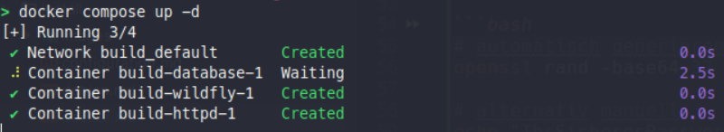
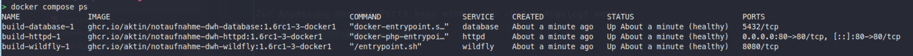

# Docker Installation

Auf dieser Seite wird die Installation und Konfiguration des AKTIN Data Warehouse mit Docker beschrieben. Diese Installationsart richtet sich an IT-Administratorinnen und -Administratoren, die den
Betrieb des Data Warehouse in einer containerisierten Umgebung bevorzugen. Das Verfahren wurde mit **Ubuntu {{ $theme.versions.ubuntu }} LTS ({{ $theme.versions.codename }})** getestet. Bei
abweichenden Systemumgebungen kontaktieren Sie bitte den [AKTIN IT-Support][support-email].

## Vorbereitung der Installation

### Voraussetzungen

Siehe [Systemanforderungen][hardware] und [Netzwerk][network].

Stellen Sie außerdem sicher, dass auf Ihrem System die aktuelle [Docker Engine][docker-engine] (≥ 24.0) und das aktuelle [Docker Compose Plugin][docker-compose] (≥ 2.0) installiert sind.

### Verzeichnisstruktur anlegen

Legen Sie ein separates Arbeitsverzeichnis für die Docker-Konfiguration des AKTIN DWH an. Dieses Verzeichnis enthält später die `compose`-Datei sowie eine Datei mit Umgebungsvariablen:

```bash
mkdir -p /opt/docker-deploy/aktin-dwh/dwh1
cd /opt/docker-deploy/aktin-dwh/dwh1
```

## Installation des Data Warehouse

### Docker-Compose-Datei herunterladen

Laden Sie die aktuelle `compose.yml` direkt aus dem offiziellen AKTIN GitHub-Repository herunter:

```bash
cd /opt/docker-deploy/aktin-dwh/dwh1
curl -LO https://github.com/aktin/docker-aktin-dwh/releases/latest/download/compose.yml
```

::: tip
Die Datei `compose.yml` definiert alle benötigten Container, Netzwerke und Volumes.
Sie können die Datei bei Bedarf anpassen, z. B. für abweichende Ports oder externe Datenbankverbindungen.
:::

### Datenbank-Passwort erstellen

Das AKTIN DWH benötigt ein internes Datenbank-Passwort. Erzeugen Sie dieses Passwort und speichern Sie es in einer Datei `secret.txt` im selben Verzeichnis wie die `compose.yml`.

```bash
# automatisch generieren (empfohlen)
openssl rand -base64 32 > secret.txt

# alternativ manuell
echo "IhrSicheresPasswort123!" > secret.txt
```

::: warning Sicherheitshinweis
Verwenden Sie ein starkes Passwort (mindestens 16 Zeichen, Groß-/Kleinbuchstaben, Zahlen und Sonderzeichen). Die Datei `secret.txt` darf nicht versioniert oder öffentlich zugänglich sein.
:::

### Optionale Umgebungsvariablen

Zur Anpassung der Standardports oder weiterer Parameter können Sie eine `.env`-Datei anlegen.

**Beispiel:** Änderung des HTTP-Ports von `80` auf `8080`. Die Variablen werden beim Start der Container automatisch übernommen.

```bash
echo "HTTP_PORT=8080" > .env
```

### Container starten

Starten Sie die Container mit Docker Compose. Der Befehl wird automatisch die benötigten AKTIN Container herunterladen und starten. 

```bash
cd /opt/docker-deploy/aktin-dwh/dwh1
docker compose up -d
```



- Das Argument `-d` startet die Container im Hintergrund.
- Nach einem Serverneustart werden die Container automatisch wieder gestartet.
- Alle Services werden in einem gemeinsamen Docker-Netzwerk betrieben.

### Status prüfen

Prüfen Sie, ob alle Container erfolgreich gestartet sind. Alle Services sollten den Status `running` oder `healthy` haben.

```bash
docker compose ps
```



::: important
Bevor Sie Ihr AKTIN Data Warehouse in Betrieb nehmen können, müssen Sie zunächst eine [initiale Konfiguration][config] vornehmen.
:::

## Betrieb und Wartung

Zur Überwachung und Verwaltung der Container stehen folgende Befehle zur Verfügung:

| Kategorie                 | Befehl                           | Beschreibung                                           |
|---------------------------|----------------------------------|--------------------------------------------------------|
| **Status & Ressourcen**   | `docker compose ps`              | Zeigt den Status aller Container an                    |
|                           | `docker stats`                   | Zeigt Ressourcenverbrauch (CPU, RAM, Netzwerk, I/O) an |
|                           | `docker compose top`             | Listet laufende Prozesse in den Containern auf         |
| **Protokolle**            | `docker compose logs`            | Zeigt die kombinierten Logs aller Container            |
|                           | `docker logs CONTAINER_NAME`     | Zeigt Logs eines bestimmten Containers                 |
|                           | `docker logs -f CONTAINER_NAME`  | Zeigt Live-Logs (Fortlaufende Ausgabe)                 |
| **Neustart & Verwaltung** | `docker compose restart SERVICE` | Startet einen einzelnen Service neu                    |
|                           | `docker compose restart`         | Startet alle Services neu                              |
|                           | `docker compose stop`            | Stoppt alle laufenden Container                        |

::: tip
Eine regelmäßige Kontrolle des Containerstatus und der verfügbaren Updates wird empfohlen.  
:::
