# Server Installation

Das AKTIN Data Warehouse ist grundsätzlich auf allen Debian-basierten Linux-Systemen lauffähig. Für die Installation auf **Ubuntu {{ $theme.versions.ubuntu }} LTS ({{ $theme.versions.codename }})**
wird ein Debian-Paket (`.deb`) bereitgestellt. Diese Anleitung beschreibt die Vorbereitung des Betriebssystems für die anschließende Installation dieses Pakets. Bei Fragen können Sie sich gerne an
den [AKTIN IT-Support][support-email] wenden.

## 1. Download der Installationsdatei

Für eine Neuinstallation wird [Ubuntu Server {{ $theme.versions.ubuntu }} LTS][ubuntu] empfohlen. Dies ist eine minimalistische Ubuntu-Version, die für den Serverbetrieb optimiert ist. Unter dem
angegebenen Link können Sie eine `.iso`-Datei herunterladen. Diese Datei muss anschließend auf ein Installationsmedium (CD oder bootfähiger USB-Stick) kopiert werden, um Ubuntu auf dem System zu
installieren.

## 2. Willkommensbildschirm

Zu Beginn der Installation werden Sie aufgefordert, eine Sprache für den Installationsprozess und das Betriebssystem auszuwählen. Diese Einstellung ist unabhängig von der Sprache des AKTIN Data
Warehouse.

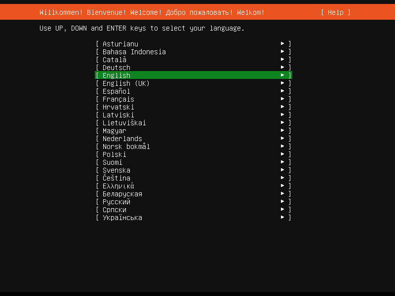

## 3. Installer-Update

Falls eine aktuellere Version der Installationssoftware verfügbar ist, bestätigen Sie den Download. Dieser Vorgang dauert nur wenige Minuten.

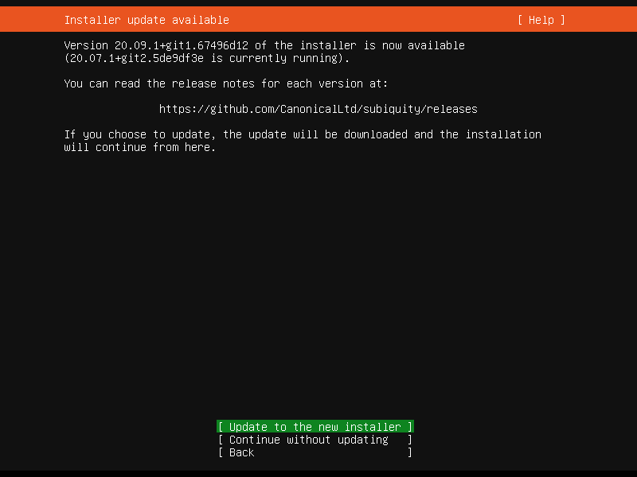

## 4. Tastaturkonfiguration

Wählen Sie Ihr Tastaturlayout aus den angezeigten Optionen. Alternativ können Sie über `Identify keyboard` das Layout automatisch erkennen lassen, indem Sie bestimmte Tasten drücken.

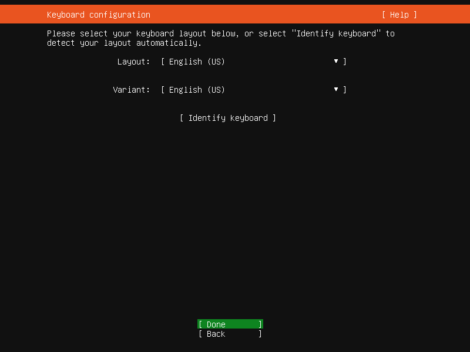

## 5. Netzwerkverbindungen

In diesem Dialog werden alle erkannten Netzwerkschnittstellen angezeigt. Wählen Sie eine Schnittstelle aus, um eine Internetverbindung herzustellen.

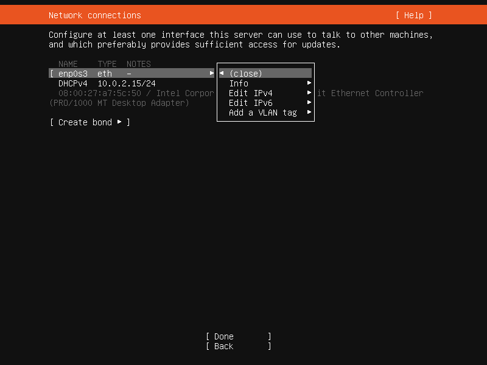
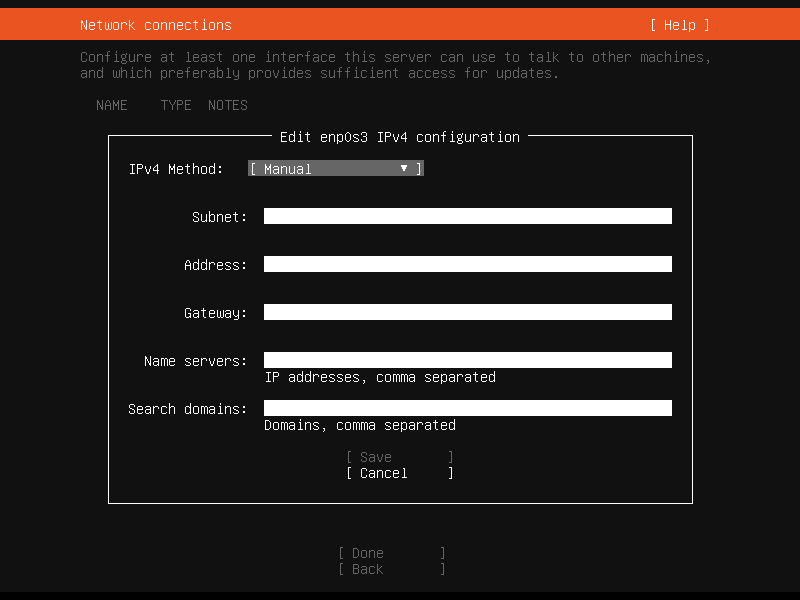

## 6. Proxy-Konfiguration

Optional können Sie einen Proxy für die Installation einrichten, falls Ihr System keinen direkten Internetzugriff hat. Geben Sie die Adresse im Format `http://[[user][:pass]@]host[:port]/` ein. Der
Proxy kann nach der Installation wieder deaktiviert werden.

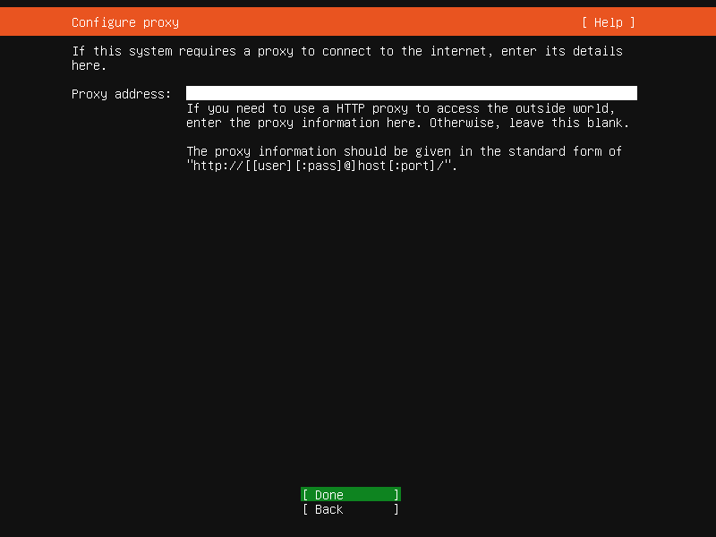

## 7. Konfiguration des Ubuntu-Archiv-Spiegelservers

Hier können Sie einen alternativen Download-Mirror für Ubuntu-Pakete angeben. Es wird empfohlen, die Standardeinstellung beizubehalten.

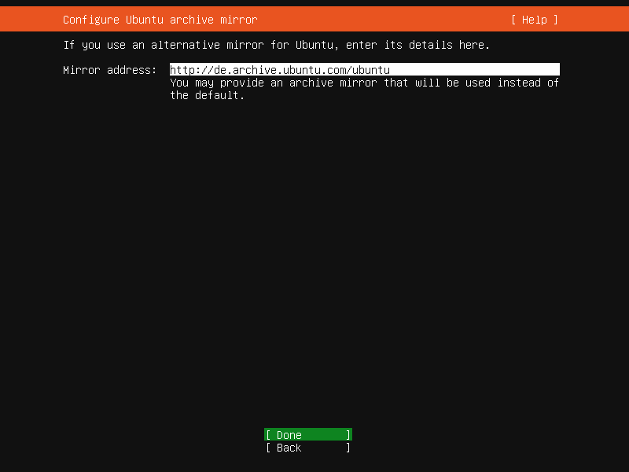

## 8. Speicherkonfiguration

Es ist ratsam, den gesamten Speicherplatz in einer Partition zu verwenden. Behalten Sie hierfür die Standardeinstellungen bei. Beachten Sie, dass dabei alle vorhandenen Daten auf dem Laufwerk gelöscht
werden. Bei einer manuellen Partitionierung sollte die Partition **mindestens 100 Gigabyte** groß sein.

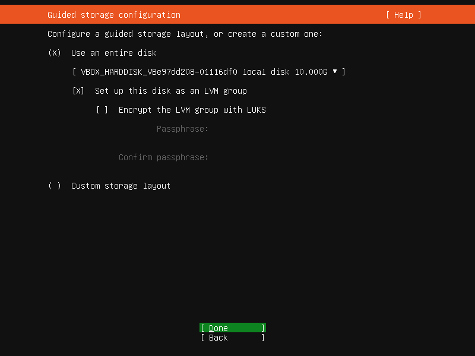
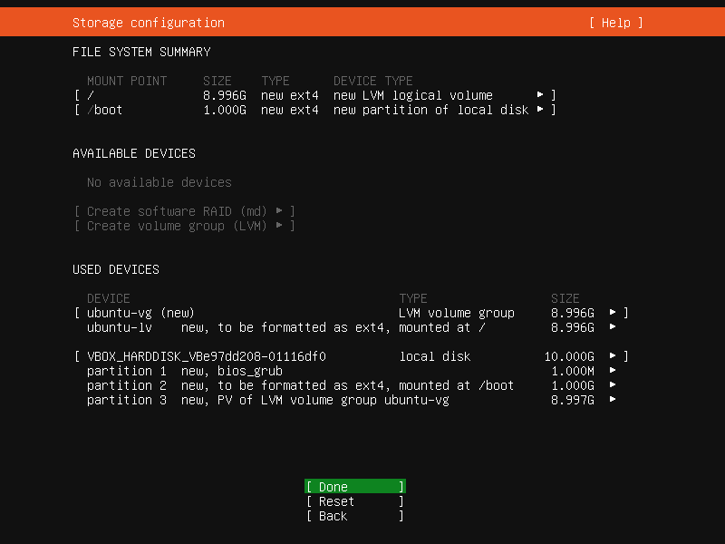
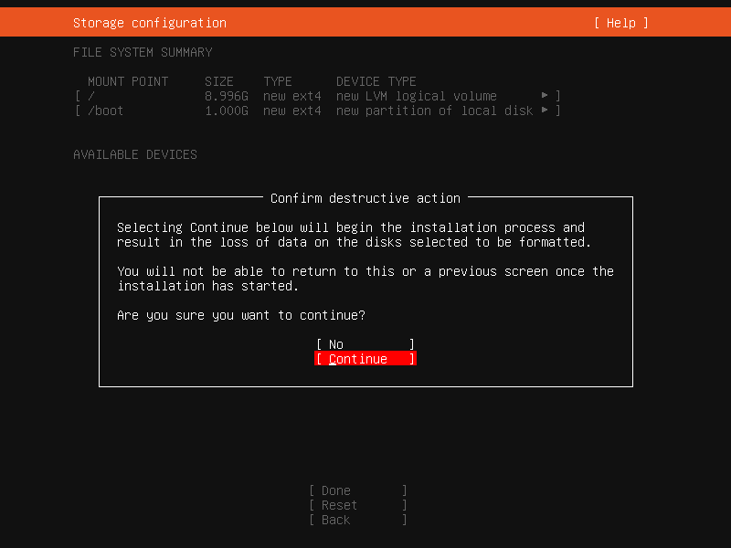

## 9. Profileinrichtung

Erstellen Sie einen Benutzer für das Betriebssystem. Wir empfehlen für das Passwort eine Kombination aus Buchstaben und Zahlen, wobei Sie auf `y`, `z` und Umlaute verzichten sollten. So können Sie
sich auch bei einer möglichen Fehlkonfiguration des Tastaturlayouts problemlos anmelden. Notieren Sie sich Benutzername und Passwort. Der Benutzer greift zwar nicht auf das AKTIN Data Warehouse zu,
wird aber benötigt, um den `root`-Nutzer freizuschalten.

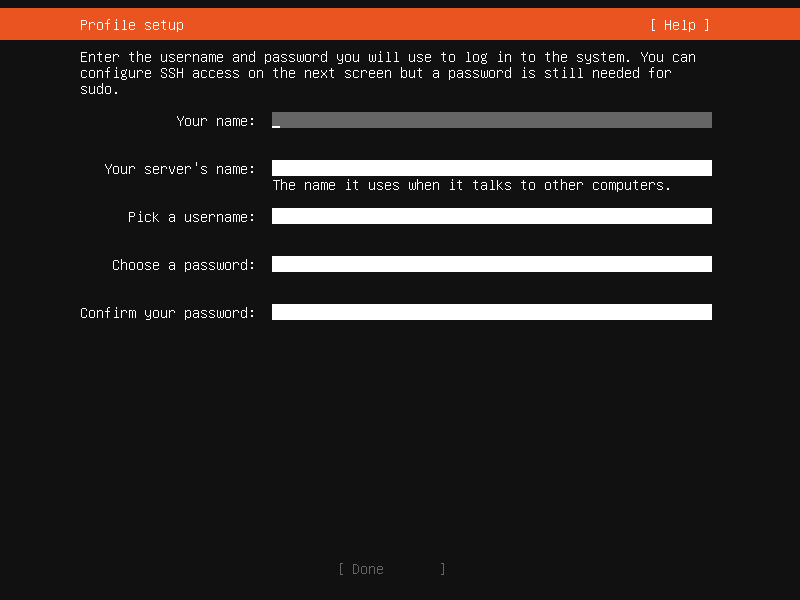

## 10. SSH-Setup und Server-Snaps

Achten Sie bei der Softwareauswahl darauf, dass **nur der OpenSSH server** zusätzlich installiert wird. Entfernen Sie alle anderen Haken, um sicherzustellen, dass keine unnötige Software auf dem
Server installiert wird.

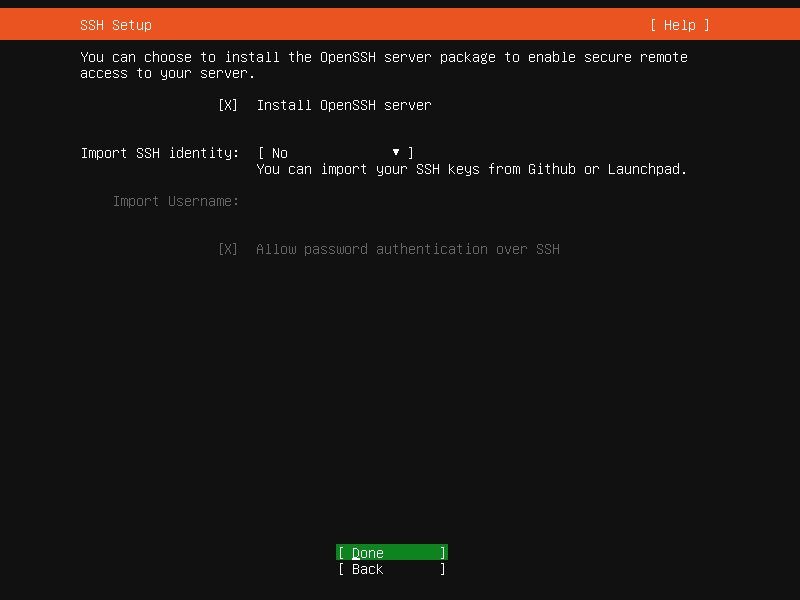
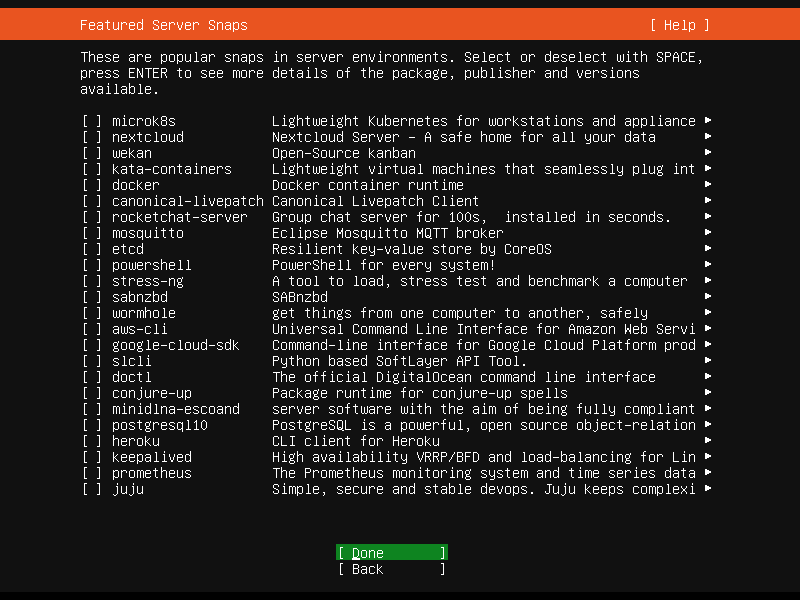

## 11. Abschluss der Installation

Nachdem alle Einstellungen vorgenommen wurden, beginnt die Installation des Betriebssystems. Am Ende werden, falls verfügbar, noch Sicherheitsupdates installiert. Anschließend müssen Sie das System
neu starten. Die Betriebssystem-Installation ist damit abgeschlossen.

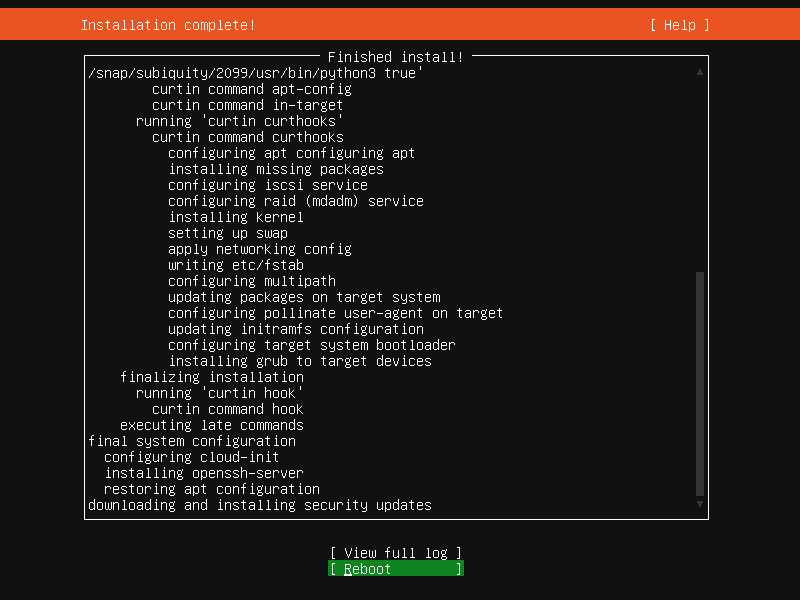
