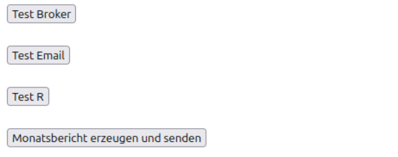
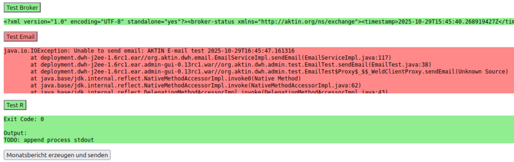

# Test der Betriebsfähigkeit

Nach Abschluss der Installation und Konfiguration sollten Sie die Betriebsfähigkeit des AKTIN Data Warehouse überprüfen. Über die integrierte Testseite können alle zentralen Komponenten verifiziert
werden.

### Aufruf der Testseite

Öffnen Sie im Webbrowser die folgende Adresse: `http://<SERVER-IP>/aktin/admin/plain/test.html`

Auf dieser Seite können Sie mehrere Funktionsprüfungen durchführen:

* **Test Broker**: Prüft die Verbindung zum zentralen AKTIN-Broker.
* **Test Email**: Sendet eine Testnachricht an die in `aktin.properties` konfigurierte E-Mail-Adressen.
* **Test R**: Überprüft die Funktionalität der R-Bibliotheken, die zur Erstellung von Berichten benötigt werden.
* **Monatsbericht erzeugen und senden**: Erstellt den AKTIN-Monatsbericht für den aktuellen Monat auf Basis der in der Datenbank gespeicherten Daten und sendet ihn an die in `aktin.properties`
  hinterlegten E-Mail-Adressen.

Ein grün hinterlegter Bereich zeigt an, dass der Test erfolgreich war und die Komponente korrekt funktioniert. Ein rot hinterlegter Bereich weist auf einen Fehler hin. Die angezeigte Fehlermeldung
enthält Hinweise zur Ursache, etwa falsche Zugangsdaten oder Verbindungsprobleme. In diesem Fall sollten Sie die entsprechenden Einstellungen in der Datei `aktin.properties` prüfen und den Test erneut
ausführen.

### Zugriff auf das Web-Interface

Nach erfolgreichem Funktionstest ist das Web-Interface des Data Warehouse unter `http://<SERVER-IP>/aktin/admin`(standardmäßig Port 80) erreichbar.
