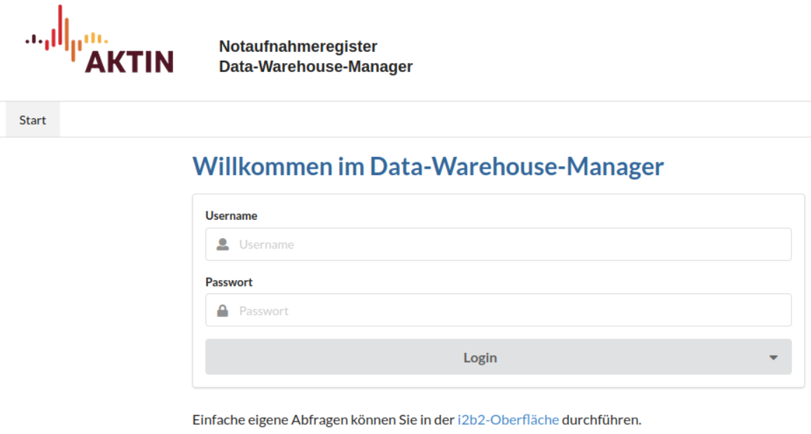
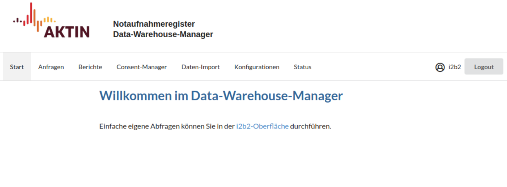
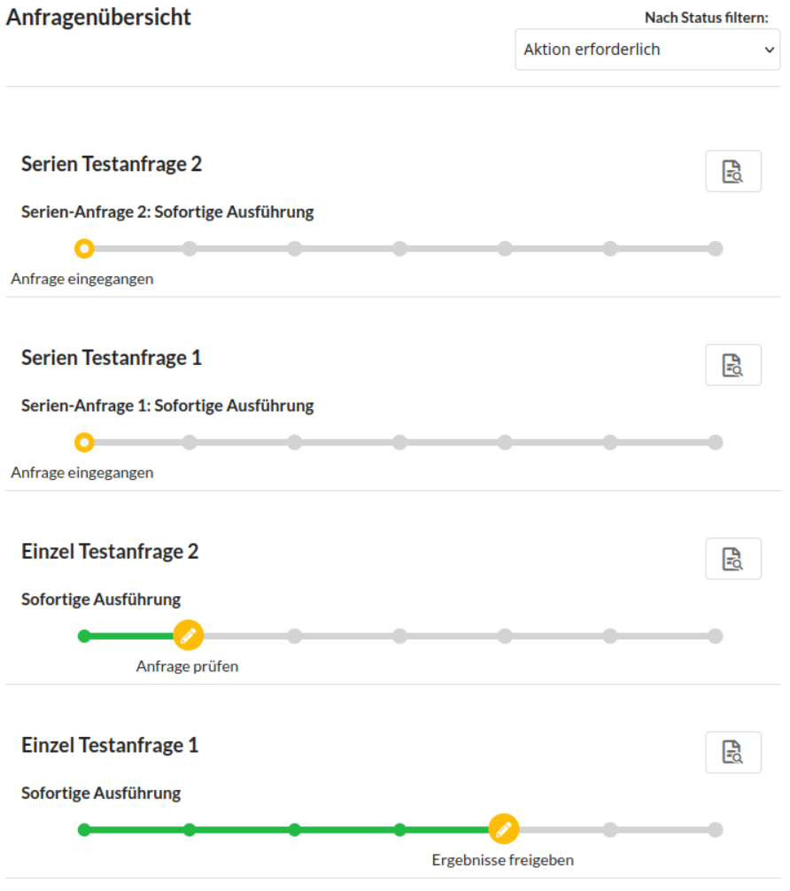
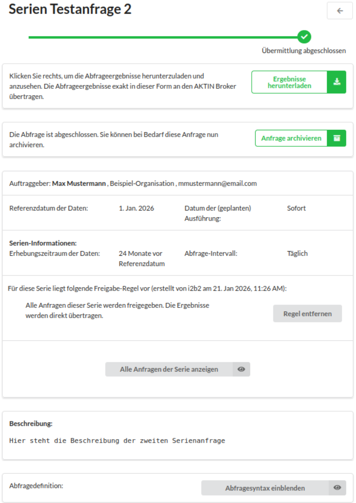

# Anleitung Data Warehouse Manager

Der Data Warehouse Manager (DWH-Manager) ist die zentrale Web-Oberfläche zur Steuerung des AKTIN DWHs. Hier verwalten Sie eingehende Datenanfragen und generieren Monatsberichte.

## Anmeldung

1. Rufen Sie die Admin-Oberfläche in Ihrem Browser auf: `http://<SERVER-IP>/aktin/admin`.

2. Melden Sie sich mit Ihren Zugangsdaten an. Dazu werden die Benutzerdaten Ihrer [i2b2-Instanz][i2b2-operation] verwendet. Nach dem Login haben Sie Zugriff auf die Verwaltung der einzelnen
   Funktionalitäten.

## Zentrale Datenanfragen verwalten

Über das AKTIN-Netzwerk gehen regelmäßig Forschungsanfragen ein. Das wichtigste Prinzip dabei ist die lokale Datenhoheit: Jede neue Anfrage muss durch Sie lokal geprüft und explizit freigegeben
werden, bevor die Daten Ihren Standort verlassen.

#### 1. Anfragenübersicht öffnen

Im Reiter *Anfragen* finden Sie die Liste aller eingegangenen Aufträge. Hier unterscheiden wir zwei Typen:

* **Einzelanfragen:** Einmalige Abfragen für einen spezifischen Zeitraum.
* **Serien-Anfragen:** Wiederkehrende Abfragen, die vom Inhalt gleich sind, aber sich im Zeitfenster unterscheiden (z. B. Wöchentlicher Export). Diese sind in der Liste entsprechend gekennzeichnet.

::: tip Übersicht der möglichen Zustände einer Anfrage

- **Eingegangen**
    - Die Anfrage wurde vom zentralen Broker abgeholt, wurde aber noch nicht geöffnet
- **Freigabe der Anfrage**
    - Die Anfrage wurde angesehen und Sie können sie nun zur Ausführung freigegeben oder abgelehnen
- **Ausführung geplant**
    - Die Anfrage wurde freigegeben und wartet auf die Ausführung, da das Ausführungsdatum noch in der Zukunft liegt
- **Ausführung läuft**
    - Die Abfrage befindet sich in der Ausführung
- **Freigabe der Ergebnisse**
    - Die Ergebnisse der Ausführung sind einsehbar und Sie können nun die Übermittlung der Ergebnisse an den AKTIN-Broker freigegeben oder abgelehnen
- **Senden der Ergebnisse**
    - Die Ergebnisse werden an den zentralen AKTIN-Broker gesendet
- **Übermittlung abgeschlossen**
    - Die Ergebnisse wurden erfolgreich übermittelt
- **Abgelehnt**
    - Die Anfrage wurde von Ihnen zurückgewiesen
- **Geschlossen**
    - Die Anfrage wurde zentral zurückgezogen, bevor sie bei Ihnen abgeschlossen wurde
- **Fehlgeschlagen**
    - Technischer Fehler. Wenden Sie sich an den [AKTIN IT-Support][support-email]

:::

#### 2. Detailansicht einer Anfrage

Klicken Sie auf das entsprechende *Prüf-Symbol* rechts in der Abfragenübersicht, um die Einzelansicht einer Anfrage aufzurufen. Hier finden Sie alle entscheidungswichtigen Informationen.

::: tabs
@tab Einzelanfrage

@tab Serienanfrage

:::

| Element                              | Beschreibung                                                                                                                               |
|:-------------------------------------|:-------------------------------------------------------------------------------------------------------------------------------------------|
| **Titel**                            | Der Titel der Abfrage. Dient zur Identifikation bei Rückfragen.                                                                            |
| **Status**                           | Der aktuelle Zustand der Anfrage (z. B. `Eingegangen`, `Ausführung geplant`), visualisiert durch einen Fortschrittsbalken                  |
| **Ablehnen / Freigeben**             | Entscheidungsschaltfläche. `Freigeben` gibt die Abfrage zur Ausführung oder Übertragung frei, `Ablehnen` weist die Anfrage zurück          |
| **Ergebnisse herunterladen**         | *Erst nach der Ausführung sichtbar:* Lädt die generierten Daten als ZIP-Datei zur Prüfung herunter                                         |
| **Anfrage archivieren**              | *Nur bei abgeschlossenen Anfragen:* Verschiebt die Anfrage in das Archiv, sodass sie in der Übersicht nicht mehr erscheint                 |
| **Auftraggeber**                     | Name des forschenden Wissenschaftlers oder der Institution, die die Anfrage stellt, mit Kontaktdaten für inhaltliche Rückfragen zur Studie |
| **Referenzdatum der Daten**          | Der zeitliche Ankerpunkt für die Abfrage. Zusammen mit dem Erhebungszeitraum bestimmt er, welcher Zeitraum konkret ausgewertet wird        |
| **Datum der (geplanten) Ausführung** | Der Zeitpunkt, an dem das Skript technisch auf dem Server läuft                                                                            |
| **Erhebungszeitraum**                | Der konkrete Zeitraum, aus dem Patientendaten ausgewertet werden                                                                           |
| **Beschreibung**                     | Erklärungstext des Auftraggebers zum Ziel der Studie                                                                                       |
| **Abfragesyntax**                    | *Ausklappbarer Text:* Zeigt das exakte Skript (SQL oder R), das auf Ihrer Datenbank ausgeführt wird                                        |

#### Sonderfunktionen für Serien-Anfragen

Handelt es sich um ein wiederkehrendes Abfrage, stehen Ihnen zusätzliche Informationen zur Verfügung:

| Element                   | Beschreibung                                                                                                                                                                                                        |
|:--------------------------|:--------------------------------------------------------------------------------------------------------------------------------------------------------------------------------------------------------------------|
| **Abfrage-Intervall**     | Gibt an, wie oft die Anfrage wiederholt wird (z. B. "Täglich", "Wöchentlich")                                                                                                                                       |
| **Automatisierte Regeln** | Verwaltung von Dauer-Entscheidungen. Zeigt aktive Regeln inkl. Ersteller/Datum an (z. B. *automatische Freigabe* oder *automatische Ablehnung*). Über *Regel entfernen* kann die Automatisierung deaktiviert werden |
| **Übersicht der Serie**   | Zeigt eine Liste aller bisherigen und geplanten Ausführungen dieser Serie an                                                                                                                                        |

#### 3. Entscheidung treffen

Bei einer Serien-Anfrage kommen noch weitere Optionen zur Auswahl hinzu. Es ist weiterhin
möglich jede einzelne Ausführung manuell freizugeben (mit oder ohne Überprüfung der
Ergebnisse). Darüber hinaus kann eine Regel für die Serie festgelegt werden. Alle
nachfolgenden Anfragen der entsprechenden Serie werden dann automatisch freigegeben
bzw. abgelehnt, sobald sie neu eingegangen sind.
Falls gewünscht, kann diese Regel auch auf bereits bestehende, nicht beantwortete Anfragen
angewendet werden (dies ist z. B. dann der Fall, wenn nach einer DWH-Neuinstallation bereits
laufende Anfragen übertragen werden oder bereits Ausführungszeitpunkte „verpasst“ wurden).
Sofern zu den betreffenden Zeiträumen Daten vorliegen, würden diese dann rückwirkend
bereitgestellt, wenn diese Option ausgewählt wird.
Die Regel kann in der Einzelansicht einer Anfrage aus der entsprechenden Serie eingesehen
und wieder entfernt werden.

Bei erfolgreich durchgeführten Abfragen können (ggf. auch vor der Übermittlung, wenn die
entsprechende Freigabe-Option gewählt wurde) die Ergebnisse als ZIP-Datei heruntergeladen
werden. Die enthaltenden Daten können in Microsoft Excel importiert werden. Vor der finalen
Freigabe und Weiterleitung der Daten besteht also die Möglichkeit die Daten zu prüfen und
erst danach eine Entscheidung zur Datenweiterleitung zu treffen.
Öffnen Sie für den Excel-Import eine Excel-Arbeitsmappe und wählen Sie unter dem Reiter
„Daten“ die Option „Aus Text“ aus, um die heruntergeladene Text-Datei zu importieren
(extrahieren Sie zunächst den ZIP-Ordner, in dem sie sich befindet). In den folgenden
Dialogen lassen sich Einstellungen bzgl. der Konvertierung festlegen. I.d.R. erkennt Excel die
richtige Einstellung von allein, sodass keine Änderungen von Ihnen gemacht werden müssen.
Die Angabe, die für einen erfolgreichen Import überprüft werden sollte, ist das Trennzeichen,
welches als Tabstopp festgelegt sein sollte. Falls dies nicht der Fall ist, so korrigieren Sie dies
bitte. Nachdem dem Bestätigen der Angaben im Dialog, haben Sie die Möglichkeit
auszuwählen wo die Tabelle eingefügt werden soll.

Nutzen Sie die Buttons am Ende der Seite, um auf die Anfrage zu reagieren:

* **Freigeben (Automatisch):** Die Ergebnisse werden direkt und verschlüsselt an den zentralen Broker übertragen.
* **Manuell Übermitteln:** Sie laden die Ergebnisdatei herunter, um sie z. B. auf einem USB-Stick zu transferieren (für strikt getrennte Netze).
* **Ablehnen:** Es werden keine Daten übertragen. Der Status "Abgelehnt" wird an den Broker gemeldet.

---

### 3. Ergebnisse validieren (Optional)

Bevor Sie die Daten versenden, können Sie die generierten Ergebnisse detailliert prüfen. Laden Sie dazu die **Ergebnis-ZIP-Datei** herunter. Die darin enthaltenen CSV-Dateien können Sie
stichprobenartig sichten.

::: details Anleitung: Import in Microsoft Excel
Die Textdateien (CSV) können zur besseren Lesbarkeit in Excel importiert werden:

1. Extrahieren Sie die ZIP-Datei.
2. Öffnen Sie in Excel eine leere Arbeitsmappe.
3. Gehen Sie zum Reiter **Daten** und wählen Sie **Aus Text/CSV**.
4. Achten Sie im Import-Dialog darauf, dass als **Trennzeichen** der *Tabstopp* ausgewählt ist.

:::

### 4. Entscheidung treffen

Am Ende der Detailansicht steuern Sie den weiteren Verlauf. Sofern die Anfrage zentral noch aktiv ist, haben Sie folgende Optionen:

* **Freigeben (Automatisch):** Die Ergebnisse werden direkt verschlüsselt und an den zentralen Broker übertragen.
* **Manuell Übermitteln:** Sie laden die verschlüsselte Ergebnisdatei herunter, um sie z. B. über einen USB-Stick zu transferieren (für DWHs ohne Internetanbindung).
* **Ablehnen:** Es werden **keine Daten** übertragen. Der Broker erhält lediglich die Information, dass die Anfrage abgelehnt wurde.

---

### Sonderfall: Serien-Anfragen verwalten

Bei Serien-Anfragen (wiederkehrenden Abfragen) haben Sie zusätzliche Steuerungsmöglichkeiten, um den Aufwand zu reduzieren:

**Automatisierte Regeln**
Sie können eine **Dauer-Freigabe** oder **Dauer-Ablehnung** einrichten.

* Sobald eine Regel aktiv ist, werden alle *zukünftigen* Anfragen dieser Serie automatisch bearbeitet, ohne dass Sie eingreifen müssen.
* Die Regel kann jederzeit in der Einzelansicht wieder entfernt werden.

**Rückwirkende Anwendung**
Wenn Sie eine Regel erstellen, fragt das System, ob diese auch auf **vergangene, offene Anfragen** angewendet werden soll.

* *Beispiel:* Nach einer Neuinstallation oder einem Urlaub haben sich 10 Wochenberichte angestaut. Mit der Option "Rückwirkend anwenden" werden alle 10 Berichte auf einmal generiert und versendet.

---

## Monatsberichte erstellen

Das DWH kann automatisierte Berichte über die Datenqualität und Kennzahlen Ihrer Notaufnahme generieren.

1. Wechseln Sie in den Reiter **Berichte**.
2. Klicken Sie auf den Button **Neuer Bericht**.
3. Wählen Sie im Dialog den Zeitraum (Monat/Jahr) aus.
4. Der Bericht erscheint in der Liste mit dem Status `wird erstellt`.

Sobald der Vorgang abgeschlossen ist, wird der Download-Button grün. Klicken Sie darauf, um den Bericht als **PDF** herunterzuladen.