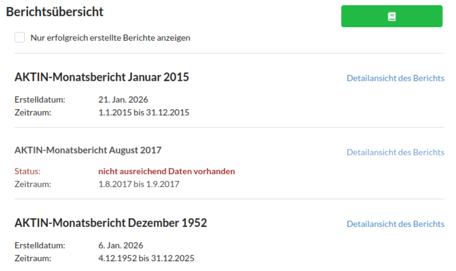
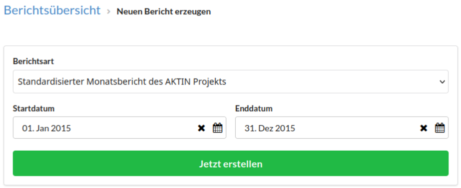
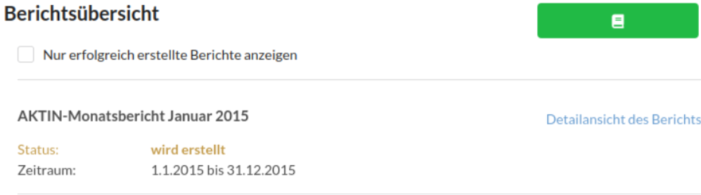
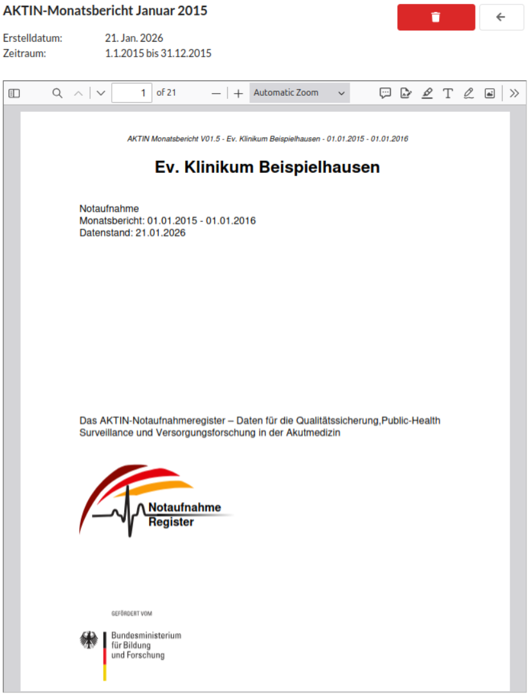

# Monatsberichte verwalten

Das DWH bietet die Möglichkeit, automatisierte Berichte über die Datenqualität und Kennzahlen Ihrer Notaufnahme zu generieren. Im Menüpunkt *Berichte* finden Sie eine Übersicht aller bisher erstellten
Dokumente.

Um eine aktuelle Auswertung zu starten, gehen Sie wie folgt vor. Klicken Sie oben rechts auf den Button *Neuer Bericht*.

Wählen Sie im Dialogfenster die gewünschte Berichtsvorlage sowie den Zeitraum (Monat/Jahr) aus. Bestätigen Sie mit *Jetzt erstellen*, um den Prozess auf dem Server zu starten. Der neue Bericht
erscheint sofort in der Liste mit dem Status `wird erstellt`. Bitte haben Sie einen Moment Geduld, die Generierung kann je nach Datenmenge einige Minuten dauern.

Sobald der Vorgang abgeschlossen ist, können Sie den PDF-Bericht direkt im Browser in der Einzelansicht (über den Button *Detailansicht des Berichts*) betrachten.

