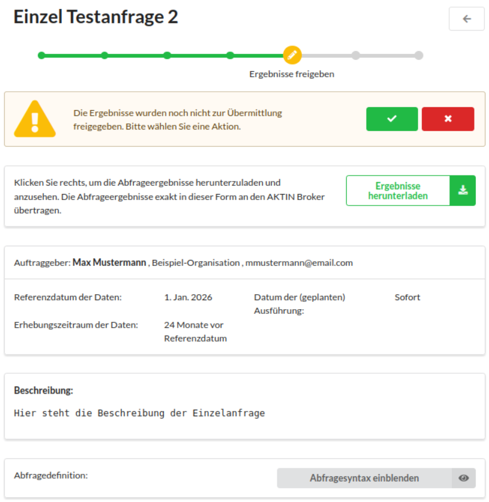
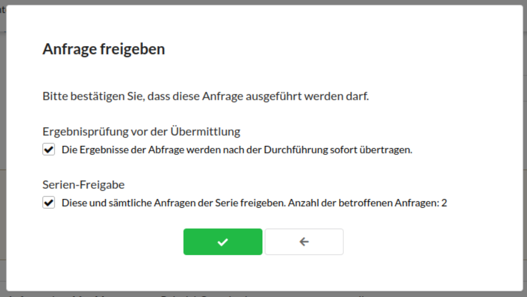
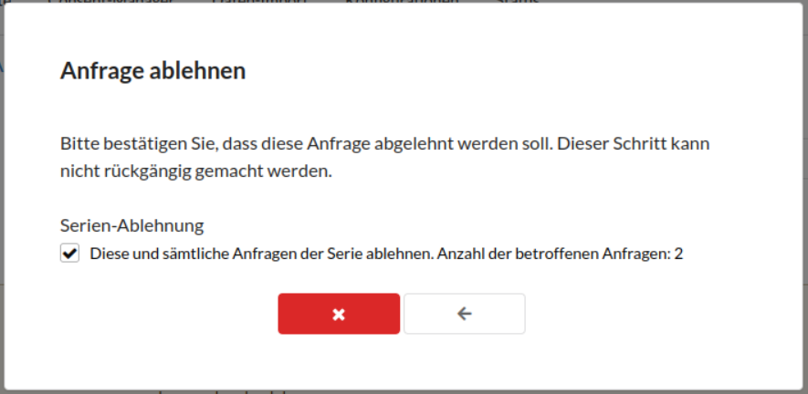
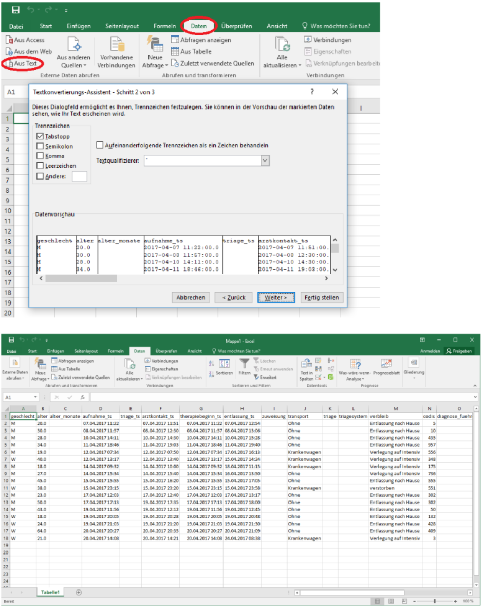

# Datenanfragen verwalten

Über das AKTIN-Netzwerk gehen regelmäßig Forschungsanfragen ein. Das wichtigste Prinzip dabei ist die lokale Datenhoheit: Jede neue Anfrage muss durch Sie lokal geprüft und explizit freigegeben
werden, bevor die Daten Ihren Standort verlassen.

## 1. Anfragenübersicht öffnen

Im Reiter *Anfragen* finden Sie die Liste aller eingegangenen Aufträge. Hier unterscheiden wir zwei Typen:

* **Einzelanfragen:**
    * Einmalige Abfragen für einen spezifischen Zeitraum
* **Serien-Anfragen:**
    * Wiederkehrende Abfragen, die vom Inhalt gleich sind, aber sich im Zeitfenster unterscheiden (z. B. Wöchentlicher Export). Diese sind in der Liste entsprechend gekennzeichnet

::: note Übersicht der möglichen Zustände einer Anfrage

- **Eingegangen**
    - Die Anfrage wurde vom zentralen Broker abgeholt, wurde aber noch nicht geöffnet
- **Freigabe der Anfrage**
    - Die Anfrage wurde angesehen und Sie können sie nun zur Ausführung freigegeben oder ablehnen
- **Ausführung geplant**
    - Die Anfrage wurde freigegeben und wartet auf die Ausführung, da das Ausführungsdatum noch in der Zukunft liegt
- **Ausführung läuft**
    - Die Abfrage befindet sich in der Ausführung
- **Freigabe der Ergebnisse**
    - Die Ergebnisse der Ausführung sind einsehbar und Sie können nun die Übermittlung der Ergebnisse an den AKTIN-Broker freigegeben oder ablehnen
- **Senden der Ergebnisse**
    - Die Ergebnisse werden an den zentralen AKTIN-Broker gesendet
- **Übermittlung abgeschlossen**
    - Die Ergebnisse wurden erfolgreich übermittelt
- **Abgelehnt**
    - Die Anfrage wurde von Ihnen zurückgewiesen
- **Geschlossen**
    - Die Anfrage wurde zentral zurückgezogen, bevor sie bei Ihnen abgeschlossen wurde
- **Fehlgeschlagen**
    - Technischer Fehler. Wenden Sie sich an den [AKTIN IT-Support][support-email]

:::

## 2. Detailansicht einer Anfrage

Klicken Sie auf das entsprechende *Prüf-Symbol* rechts in der Abfragenübersicht, um die Einzelansicht einer Anfrage aufzurufen. Hier finden Sie alle entscheidungswichtigen Informationen.

::: tabs
@tab Einzelanfrage

@tab Serienanfrage

:::

| Element                              | Beschreibung                                                                                                                               |
|:-------------------------------------|:-------------------------------------------------------------------------------------------------------------------------------------------|
| **Titel**                            | Der Titel der Abfrage. Dient zur Identifikation bei Rückfragen.                                                                            |
| **Status**                           | Der aktuelle Zustand der Anfrage (z. B. `Eingegangen`, `Ausführung geplant`), visualisiert durch einen Fortschrittsbalken                  |
| **Ablehnen / Freigeben**             | Entscheidungsschaltfläche. `Freigeben` gibt die Abfrage zur Ausführung oder Übertragung frei, `Ablehnen` weist die Anfrage zurück          |
| **Ergebnisse herunterladen**         | *Erst nach der Ausführung sichtbar:* Lädt die generierten Daten als ZIP-Datei zur Prüfung herunter                                         |
| **Anfrage archivieren**              | *Nur bei abgeschlossenen Anfragen:* Verschiebt die Anfrage in das Archiv, sodass sie in der Übersicht nicht mehr erscheint                 |
| **Auftraggeber**                     | Name des forschenden Wissenschaftlers oder der Institution, die die Anfrage stellt, mit Kontaktdaten für inhaltliche Rückfragen zur Studie |
| **Referenzdatum der Daten**          | Der zeitliche Ankerpunkt für die Abfrage. Zusammen mit dem Erhebungszeitraum bestimmt er, welcher Zeitraum konkret ausgewertet wird        |
| **Datum der (geplanten) Ausführung** | Der Zeitpunkt, an dem das Skript technisch auf dem Server läuft                                                                            |
| **Erhebungszeitraum**                | Der konkrete Zeitraum, aus dem Patientendaten ausgewertet werden                                                                           |
| **Beschreibung**                     | Erklärungstext des Auftraggebers zum Ziel der Studie                                                                                       |
| **Abfragesyntax**                    | *Ausklappbarer Text:* Zeigt das exakte Skript (SQL oder R), das auf Ihrer Datenbank ausgeführt wird                                        |

::: note Sonderfunktionen für Serien-Anfragen
Handelt es sich um ein wiederkehrendes Abfrage, stehen Ihnen zusätzliche Informationen zur Verfügung:

| Element                   | Beschreibung                                                                                                                                                                                                        |
|:--------------------------|:--------------------------------------------------------------------------------------------------------------------------------------------------------------------------------------------------------------------|
| **Abfrage-Intervall**     | Gibt an, wie oft die Anfrage wiederholt wird (z. B. "Täglich", "Wöchentlich")                                                                                                                                       |
| **Automatisierte Regeln** | Verwaltung von Dauer-Entscheidungen. Zeigt aktive Regeln inkl. Ersteller/Datum an (z. B. *automatische Freigabe* oder *automatische Ablehnung*). Über *Regel entfernen* kann die Automatisierung deaktiviert werden |
| **Übersicht der Serie**   | Zeigt eine Liste aller bisherigen und geplanten Ausführungen dieser Serie an                                                                                                                                        |

:::

## 3. Entscheidung treffen

Nachdem Sie die Metadaten und den Quellcode geprüft haben, treffen Sie über die Entscheidungsschaltfläche Ihre Entscheidung. Dabei öffnet sich jeweils ein Dialogfenster, in dem Sie den genauen Ablauf
steuern können.

::: tip Option A: Anfrage freigeben

Wenn Sie der Durchführung zustimmen, klicken Sie auf die grüne Schaltfläche. Es öffnet sich ein Dialog zur Bestätigung. Hier legen Sie fest, ob die Daten sofort übertragen oder erst geprüft werden
sollen.

Wenn Sie das Häkchen zu *Ergebnisprüfung vor der Übermittlung* setzen, verbleiben die Daten zunächst lokal auf Ihrem Server. Dies ermöglicht eine manuelle Prüfung vor dem Versand. Die Übermittlung
selbst erfordert dann eine zweite Bestätigung. Ist das Häkchen nicht gesetzt, werden die Ergebnisse unmittelbar nach der Berechnung verschlüsselt versendet. Es ist keine weitere Interaktion notwendig.

:::

::: danger Option B: Anfrage ablehnen

Wenn Sie die Anfrage zurückweisen möchten, klicken Sie auf die rote Schaltfläche. Es öffnet sich ein Dialog zur Ablehnung.

Bei der Ablehnung der Anfrage wird die Anfrage nicht ausgeführt und es werden auch keine medizinischen Daten erhoben oder versendet. Der Broker erhält lediglich den Status *Abgelehnt* von Ihrem
Standort.

:::

::: note Besonderheit bei Serienanfragen (Automatisierung)

Handelt es sich um eine Serienanfrage, sehen Sie in den Popups zusätzliche Checkboxen zur Automatisierung:

**1. Regel erstellen (Dauer-Entscheidung)**: Durch Aktivieren der Checkbox *Diese und sämtliche Anfragen der Serie...* erstellen Sie eine Regel. Das System merkt sich Ihre Entscheidung (Freigabe oder
Ablehnung). Alle zukünftigen Anfragen dieser Serie werden automatisch verarbeitet, sobald sie eintreffen.

**2. Rückwirkende Anwendung**: Wenn Sie eine Serienanfrage freigeben oder ablehnen, erscheint oft eine weitere Option: *Auch bereits bestehende Anfragen...*. Dies ist nützlich, wenn sich (z. B. durch
Urlaub oder Neuinstallation) mehrere offene Anfragen angestaut haben. Aktivieren Sie diese Option, um den Rückstau mit einem Klick abzuarbeiten.

:::

## 4. *(Optional)* Ergebnisse validieren

Wenn Sie sich für die vorherige Prüfung entschieden haben, steht nach der Berechnung ein ZIP-Archiv mit den Ergebnissen zum Download bereit. Speichern und entpacken Sie dieses Archiv zunächst auf
Ihrem lokalen Rechner, um die darin enthaltenen CSV-Dateien stichprobenartig auf ihre inhaltliche Korrektheit zu kontrollieren.

::: info

Für eine leserliche Darstellung in Microsoft Excel empfiehlt sich der Weg über die Import-Funktion, statt die Dateien direkt zu öffnen. Starten Sie hierfür eine leere Arbeitsmappe, wechseln Sie auf
den Reiter *Daten* und wählen Sie die Funktion *Aus Text* (bzw. *Aus Text/CSV*). Im darauffolgenden Import-Dialog ist es entscheidend, dass Sie als Trennzeichen den Tabstopp auswählen, damit die
Spalten korrekt erkannt werden.

:::
