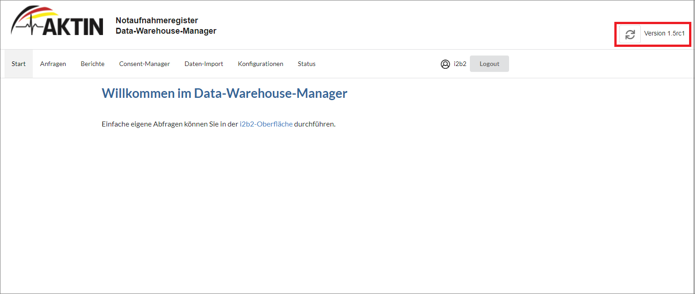
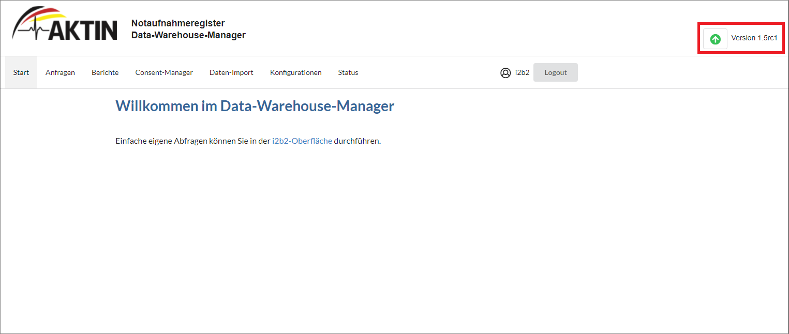
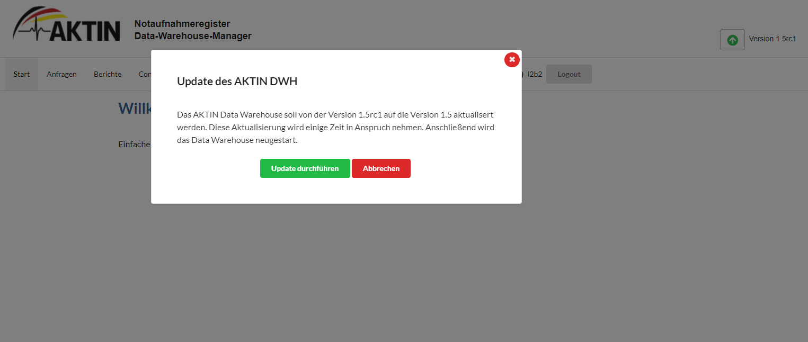
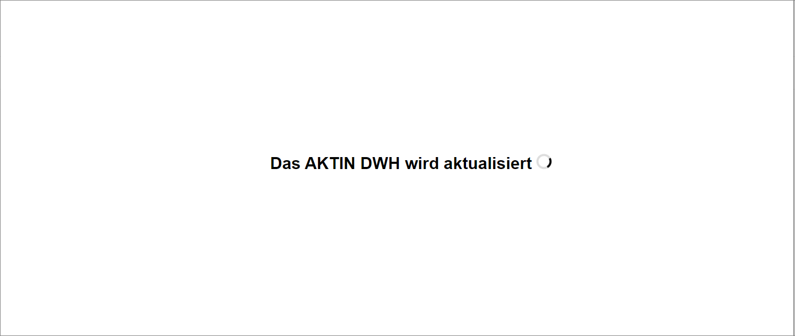
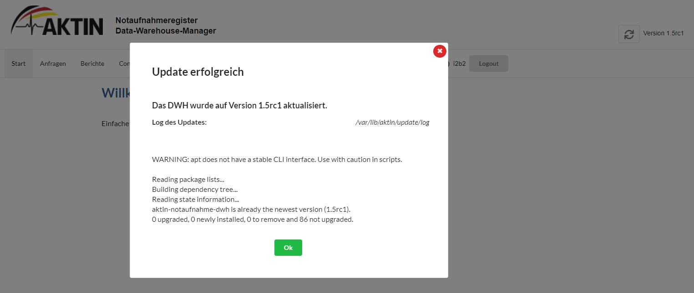

# Debian Update

Seit Version 1.5 des AKTIN Data Warehouse wurde der Updateprozess durch die Debian-Paketierung deutlich vereinfacht. Anstelle eines separaten Skripts übernimmt nun der Debian-Paketmanager das Update
automatisch im Hintergrund.

Sie können das Update über die Kommandozeile (CLI) oder die Web-Oberfläche starten. Das Data Warehouse wird während des Vorgangs neu gestartet. Falls das Update fehlschlägt, stellt das System
automatisch die vorherige Version wieder her. In diesem Fall wenden Sie sich bitte an das [AKTIN-IT-Team][support-email].

::: warning
Diese Anleitung gilt nur für Updates ab Version 1.5. Für eine Aktualisierung von Version 1.4 oder älter, wenden Sie sich an das [AKTIN-IT-Team][support-email].
:::

## Ausführung des Updates über die Kommandozeile

Für das Update müssen alle Befehle als `root` ausgeführt werden. Falls der `root`-Nutzer noch nicht aktiviert ist, folgen Sie den Hinweisen im Abschnitt [Freischaltung von root][activate-root] der
Installationsanleitung.

Führen Sie zunächst den Befehl aus, um in den `root`-Nutzer zu wechseln:

```bash
sudo -i
```

Prüfen Sie Ihr installiertes Betriebssystem über den Befehl:

```bash
lsb_release -a
```

Die Ausgabe sollte Ubuntu {{ $theme.versions.ubuntu }} LTS (Codename {{ $theme.versions.codename }}) enthalten.

Für das Upgrade auf die aktuelle Version {{ $theme.versions.dwh }} wird das AKTIN "{{ $theme.versions.codename }}" Repository benötigt. Falls es nicht vorhanden ist, folgen Sie den Hinweisen im
Abschnitt [AKTIN Repository einbinden][repo-aktin] der Installationsanleitung, um es hinzuzufügen.

Anschließend können Sie über folgende Befehle die Paketlisten des Paketmanagers neu einzulesen und die neusten verfügbaren Pakete des AKTIN Data Warehouse installieren:

```bash
apt-get update
apt-get --only-upgrade install aktin-notaufnahme-i2b2
apt-get --only-upgrade install aktin-notaufnahme-dwh
apt-get --only-upgrade install aktin-notaufnahme-updateagent
```

Mit diesen Befehlen werden die drei zentralen Pakete des Data Warehouse auf die jeweils aktuelle Version aktualisiert. Das Flag `--only-upgrade` sorgt dafür, dass keine neuen Pakete installiert,
sondern nur bestehende aktualisiert werden. Weitere Schritte sind nicht erforderlich. Während des Updates steht das Data Warehouse nicht zur Verfügung. Wenn bereits die aktuelle Version installiert
ist, zeigt die Konsole einen entsprechenden Hinweis. Nach Abschluss des Updates kann das Data Warehouse wieder normal verwendet werden.

## Ausführung des Updates über die Ansicht des DWH

Um das AKTIN Data Warehouse über die Ansicht zu aktualisieren, wechseln Sie zunächst zum AKTIN Data Warehouse in Ihrem Browser.

### 1. Suche nach einer neuen Version

Klicken Sie oben rechts auf den Update-Button. Während der Suche zeigt der Button eine laufende Animation. Wenn die Animation endet, ohne dass sich der Button ändert, ist bereits die aktuelle Version
installiert.



### 2. Initialisierung des Update-Vorgangs

Wenn eine neue Version gefunden wurde, ändert sich der Button. Klicken Sie ihn an, um das Update zu starten. Ein Hinweisfenster informiert Sie darüber, dass das Data Warehouse während des Updates
nicht verfügbar ist und nach Abschluss automatisch neu gestartet wird. Bestätigen Sie den Hinweis, um den Vorgang zu beginnen.





### 3. Durchführung des Updates

Während des Updates werden Sie auf eine externe Statusseite weitergeleitet. Dort sehen Sie den Fortschritt des Prozesses. Nach Abschluss werden Sie automatisch auf die Startseite des Data Warehouse
zurückgeleitet.



### 4. Abschluss des Updates

Nach dem Update erscheint ein Hinweisfenster mit dem Ergebnis und der Konsolenausgabe. Schließen Sie dieses Fenster, um wieder in den Normalbetrieb zu wechseln. Das Popup kann jederzeit erneut
geöffnet werden, indem Sie auf die Versionsnummer oben rechts klicken.


