# Fehlerbehebungsartikel

[Add troubleshooting
article](https://confluence-imi.ukaachen.de?createDialogBlueprintId=61cf3a09-11aa-4cc7-9708-36893724e901&createDialogSpaceKey=AKTIN)

## Adminkonsole Fehler 404

### Hintergrund

Beim Aufrufen der Adminkonsole kann es sein, dass keien Ressourcen
gefunden werden können. Das traf in der Vergangenheit auf, wenn die
Ubuntu Version oder DWH Version verändert wurde.

### Fehlersuche

<table>
<colgroup>
<col style="width: 6%" />
<col style="width: 12%" />
<col style="width: 32%" />
<col style="width: 13%" />
<col style="width: 35%" />
</colgroup>
<thead>
<tr class="header">
<th>Schritt</th>
<th>Beschreibung</th>
<th>Befehl</th>
<th>Ausschnitt</th>
<th>Bemerkung</th>
</tr>
</thead>
<tbody>
<tr class="odd">
<td>1</td>
<td>Wildfly Status checken</td>
<td>
<strong>sudo service wildfly status</strong>

oder

<strong>sudo systemctl status wildfly.service</strong>
</td>
<td>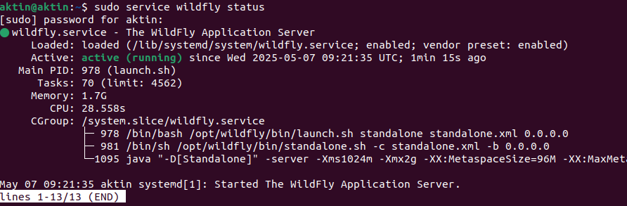</td>
<td><ul>
<li>
muss active(running) anzeigen
</li>
</ul></td>
</tr>
<tr class="even">
<td>2</td>
<td>Wildfly Logs checken</td>
<td><strong>sudo nano
/opt/wildfly/standalone/log/server.log</strong></td>
<td></td>
<td><ul>
<li>
suche nach logs die "ERROR" anzeigen
</li>
</ul></td>
</tr>
<tr class="odd">
<td>3</td>
<td>Deployments ansehen</td>
<td><strong>sudo ls /opt/wildfly/standalone/deployments/</strong></td>
<td>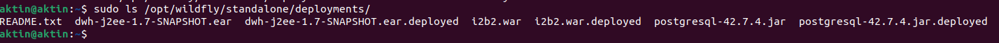</td>
<td><ul>
<li>
Prüfe ob die Dateien Endungen haben wie ".failed" oder
".isDeploying". Nur wenn wie hier alle Dateien auf ".deployed" enden,
ist alles gut
</li>
</ul></td>
</tr>
<tr class="even">
<td>4</td>
<td>Apache Status checken</td>
<td><strong>sudo systemctl status apache2</strong></td>
<td>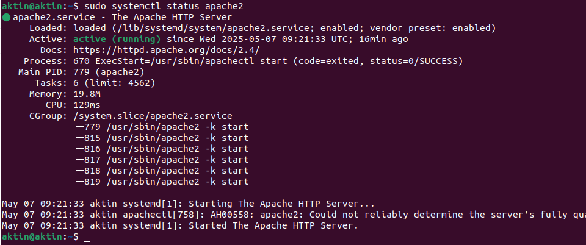</td>
<td><ul>
<li>
muss active(running) anzeigen
</li>
<li>
bei Fehler wird in der Konsole ausgegeben, wie der Log ausgegeben
werden kann, dort muss man nach dem Fehler suchen, meistens ein Modul
das nicht gefunden wird. Wenn das Modul existier, aber in einer anderen
Version (prüfe mit &lt;modulname&gt; -v) dann muss man die Apache
konfiguration Ändern:

<ul>
<li>
sudo a2dismod &lt;modulname&gt;&lt;alteversion&gt;
</li>
<li>
sudo a2enmod &lt;modulname&gt;&lt;neueversion&gt;
</li>
<li>
sudo systemctl restart apache2
</li>
</ul></li>
</ul></td>
</tr>
</tbody>
</table>

### Verwandte Artikel

- Page:[Monatsbericht/Report: Abnormal Termination
  Exception](#monatsberichtreport-abnormal-termination-exception)

- Page:[DWH verliert regelmäßig Kontakt mit Broker bis zum Wildfly
  neustart](#dwh-verliert-regelmäßig-kontakt-mit-broker-bis-zum-wildfly-neustart)

- Page:[Wildfly Startet nicht mehr](#wildfly-startet-nicht-mehr)

- Page:[Wildfly hat keine Verbindung zu
  Postgresql](#wildfly-hat-keine-verbindung-zu-postgresql)

- Page:[DWH 1.6 Update depends on postgresql
  \<=229](#dwh-1.6-update-depends-on-postgresql-229)

## Anfragen an das DWH führen zu Absturz

### Problem

Das Magdeburger DWH stürzt immer dann ab wenn eine Anfrage eingeht. 
Problem sind Fehlerhafte Tabellen in der AKTIN Datenbank im DWH.

### Lösung

Leeren der Tabellen request_action_log, broker_requests,

<table>
<colgroup>
<col style="width: 100%" />
</colgroup>
<thead>
<tr class="header">
<th><ol type="1">
<li>
login as: root
</li>
<li>
Stop wildfly, wechsel zu User postgres,
</li>
</ol>
<table>
<colgroup>
<col style="width: 100%" />
</colgroup>
<thead>
<tr class="header">
<th>
service wildfly stop

su - postgres
</th>
</tr>
</thead>
<tbody>
</tbody>
</table>

Code block 24 Einloggen

<ol start="3" type="1">
<li>
Dump der Datenbank erzeugen
</li>
</ol>
<table>
<colgroup>
<col style="width: 100%" />
</colgroup>
<thead>
<tr class="header">
<th>pg_dump -d aktin | gzip &gt; /var/tmp/aktin_db.sql.gz</th>
</tr>
</thead>
<tbody>
</tbody>
</table>

Code block 25 DB Dump

<blockquote>

Optional: Prüfen des Dump

Dump überprüfen in Ordner tmp

</blockquote>
<table>
<colgroup>
<col style="width: 100%" />
</colgroup>
<thead>
<tr class="header">
<th>
postgres@debiandwh:~$ logout

root@debiandwh:~# mv /var/tmp/aktin_db.sql.gz /root/

root@debiandwh:~# gunzip aktin_db.sql.gz

root@debiandwh:~# ls -lh

total 29M

-rw-r--r-- 1 postgres postgres 672K Apr 24 12:37
aktin_db.sql
</th>
</tr>
</thead>
<tbody>
</tbody>
</table>

Code block 26 Prüfen des Dump. Achtung: komplette Shell Ausgabe zum
Prüfen!

<blockquote>

Anschließend wieder als Postgres User einloggen

</blockquote>
<table>
<colgroup>
<col style="width: 100%" />
</colgroup>
<thead>
<tr class="header">
<th>su - postgres</th>
</tr>
</thead>
<tbody>
</tbody>
</table>

Code block 27 Einloggen

<ol start="4" type="1">
<li>
Truncate Tables broker_requests,broker_query_rules,
request_action_log
</li>
</ol>
<table>
<colgroup>
<col style="width: 100%" />
</colgroup>
<thead>
<tr class="header">
<th>
psql -d aktin -c 'TRUNCATE aktin.broker_requests'

psql -d aktin -c 'TRUNCATE aktin.broker_query_rules'

psql -d aktin -c 'TRUNCATE aktin.request_action_log'
</th>
</tr>
</thead>
<tbody>
</tbody>
</table>

Code block 28 Truncate

<ol start="5" type="1">
<li>
Switch User: root, Start Wildfly
</li>
</ol>
<table>
<colgroup>
<col style="width: 100%" />
</colgroup>
<thead>
<tr class="header">
<th>
logout

service wildfly start
</th>
</tr>
</thead>
<tbody>
</tbody>
</table>

Code block 29 Wildfly Starten
</th>
</tr>
</thead>
<tbody>
</tbody>
</table>

1.  **Verwandte Artikel**

2.  

- Page:[DWH 1.6 Update depends on postgresql
  \<=229](#dwh-1.6-update-depends-on-postgresql-229)

- Page:[DWH Update 1.6 verbindet sich nicht mehr mit dem
  Broker](#dwh-update-1.6-verbindet-sich-nicht-mehr-mit-dem-broker)

- Page:[Zugriff per PGAdmin auf ein lokales AKTIN
  DWH](#zugriff-per-pgadmin-auf-ein-lokales-aktin-dwh)

- Page:[HTTPS-Zugriff aktivieren](#https-zugriff-aktivieren)

- Page:[DWH Logdateien erstellen](#dwh-logdateien-erstellen)

## DWH 1.6 Update depends on postgresql \<=229

### Problem

Bei installation von DWH 1.6 auf Ubuntu 22 required DWH Paket postgresql
version \<=299, aber System will 244ubuntu0.1 installieren:

"packages have unmet dependncies: postgresql-14: Depends:
postgresql-common (\<=229) but 214ubuntu0.1 is to be installed"

### Lösung

<table>
<colgroup>
<col style="width: 100%" />
</colgroup>
<thead>
<tr class="header">
<th><ol type="1">
<li>
Postgres über offizielles Repo installieren: 
curl -fsSL <a
href="https://www.postgresql.org/media/keys/ACCC4CF8.asc|sudo">https://www.postgresql.org/media/keys/ACCC4CF8.asc|sudo</a>
gpg --dearmor -o /etc/apt/trusted.gpg.d/postgresql.gpg 
sudo sh -c 'echo "deb <a
href="http://apt.postgresql.org/pub/repos/apt">http://apt.postgresql.org/pub/repos/apt</a>
$(lsb_release -cs)-pgdg main" &gt;
/etc/apt/sources.list.d/pgdg.list' 
sudo apt update 
 
(zwar deprecated aber tested, falls das Repo sich nicht mir curl
einbinden lässt) 
wget --quiet -O - <a
href="https://www.postgresql.org/media/keys/ACCC4CF8.asc">https://www.postgresql.org/media/keys/ACCC4CF8.asc</a>
| sudo apt-key add - 
echo "deb <a
href="http://apt.postgresql.org/pub/repos/apt">http://apt.postgresql.org/pub/repos/apt</a>
$(lsb_release -cs)-pgdg main" | sudo tee
/etc/apt/sources.list.d/pgdg.list 
sudo apt update
</li>
<li>
sudo apt install postgresql-14
</li>
<li>
DWH Update manuell ausführen: 
sudo -i 
apt-get --only-upgrade install aktin-notaufnahme-i2b2 
apt-get --only-upgrade install aktin-notaufnahme-updateagent 
apt-get --only-upgrade install aktin-notaufnahme-dwh 
nc -w 2 127.0.0.1 1002
</li>
<li>
ggf. Wildfly neu starten: service wildfly restart
</li>
</ol></th>
</tr>
</thead>
<tbody>
</tbody>
</table>

1.  **Verwandte Artikel**

2.  

- Page:[DWH 1.6 Update depends on postgresql
  \<=229](#dwh-1.6-update-depends-on-postgresql-229)

- Page:[DWH Update 1.6 verbindet sich nicht mehr mit dem
  Broker](#dwh-update-1.6-verbindet-sich-nicht-mehr-mit-dem-broker)

- Page:[Zugriff per PGAdmin auf ein lokales AKTIN
  DWH](#zugriff-per-pgadmin-auf-ein-lokales-aktin-dwh)

- Page:[HTTPS-Zugriff aktivieren](#https-zugriff-aktivieren)

- Page:[DWH Logdateien erstellen](#dwh-logdateien-erstellen)

## DWH Update 1.6 verbindet sich nicht mehr mit dem Broker

### Problem

Beim Update des DWHs von version 1.5 auf 1.6 ,bricht die Verbindung zum
Broker mit einem "ConnectionTimeout" Fehler ab. Browser können den
Broker erreichen und der WIldfly User kann mit einem Curl befehl
ebenfalls den Broker erreichen. Hierbei wurde die Adresse
"<https://aktin-broker.klinikum.rwth-aachen.de/broker/status>" als Test
verwendet. Das Problem tritt bislang nur an einem Standort auf, während
andere Standorte bereits erfolgreich DWH version 1.6 nutzen. 

### Idee

Da der Broker im Browser und auch vom Terminal aus erreichbar ist,
können wir vorerst davon ausgehen, dass die Firewall nicht das Problem
ist (laut Kunden war die Firewall auch aus). Der Fehler wird im Wildfly
Log Server-Log ausgegeben, was bedeutet er tritt auf, wenn eines der
Wildfly oder DWH Pakete eine Verbindung herstellen möchte. Der Fehler
beginnt folgendermaßen "[java.net](http://java.net).ConnectException:
Connection timed out (Connection timed out)", was den Ursprung auf eine
Java Applikation eingrenzt, was sowol im DWH als auch in Wildfly genutzt
wird. Der Fehler könnte dadurch ermittelt werden, indem die betroffenen
Stellen in Wildfly nud DWH geprüft werden. Weiterhin steht in der
Fehlermeldung, wo der Fehler unter anderem auftaucht :

"

org.aktin.dwh.admin.test.BrokerTest.retrieveStatus(BrokerTest.java:28)

...

at
deployment.dwh-j2ee-1.6rc1.ear.admin-gui-0.13rc1.war//org.aktin.dwh.admin.test.BrokerTest.retrieveStatus(BrokerTest.java:28)

at
deployment.dwh-j2ee-1.6rc1.ear.admin-gui-0.13rc1.war//org.aktin.dwh.admin.test.BrokerTest\$Proxy\$\_\$\$\_WeldClientProxy.retrieveStatus(Unknown
Source)

". 

Der Main Fehler tritt im Repository "dwh-admin" im "admin-gui" Projekt
auf. Betroffen ist der Backend Endpoint "test/broker/status", welcher
eine HTTP Request an den Broker (broker_url/broker/status) sendet.
Dieser Code wurde seit 2017 nicht mehr verändert und kann strukturell
nicht der Grund für die Fehlschlagende Anfrage sein. Es ist entweder
eine falsche Konfiguration oder eine Änderung in den Abhängigkeiten
dieses Codes. ... Hier weitermachen

### Fehleranalyse

Alexander Kombeiz vermutet die Ursache in einer Änderung in den
Repositories
"[**debian-i2b2-pkg**](https://github.com/aktin/debian-i2b2-pkg)" und "
[**debian-dwh-pkg**](https://github.com/aktin/debian-dwh-pkg)".
Vermutlich wurden im neuen Release Pakete aktualisiert.

#### Paket Änderungen in j2ee:

- dwh-prefs      : 0.11 -\> 0.12

  - hsqldb      : 2.5.0 -\> 2.7.1

  - dwh-db      : 0.11 -\> 0.12

  - dwh-api     : 0.9 -\> 0.10

- report-archive : 0.12 -\> 0.13

  - dwh-db        : 0.11 -\> 0.12

  - dwh-api       : 0.9 -\> 0.10

- admin-gui      : 0.11 -\> 0.13

  - dwh-prefs                    : 0.11 -\> 0.12

  - dwh-api                      : 0.9 -\> 0.10

  - [javax.ws](http://javax.ws).rs-api              : 2.0.1 -\> 2.1.1

  - generic-file-importer        : 0.17 -\> 0.19rc1

  - report-archive               : 0.12 -\> 0.13

  - jetty-server                 : 9.2.14.v20151106 -\> 9.4.55.v20240627

  - study-manager                : 0.12 -\> 0.13

  - dwh-db                       : 0.11 -\> 0.12

  - request-manager              : 0.12 -\> 0.13

  - report-manager               : 0.12 -\> 0.13

  - aktin-monthly  : 0.12 -\> 0.13

  - dwh-db         : 0.11 -\> 0.12

- request-manager: 0.12 -\> 0.13

  - dwh-db                 : 0.11 -\> 0.12

  - dwh-api                : 0.9 -\> 0.10

- report-schedule: 0.12 -\> 0.13

  - dwh-api   : 0.9 -\> 0.10

- dwh-api        : 0.9 -\> 0.10

- study-manager  : 0.12 -\> 0.13

  - dwh-db     : 0.11 -\> 0.12

  - dwh-api    : 0.9 -\> 0.10

- report-manager : 0.12 -\> 0.13

  - dwh-prefs      : 0.11 -\> 0.12

  - dwh-api        : 0.9 -\> 0.10

- cda-import     : 0.17 -\> 0.19rc1

Änderungen im "j2ee" Repository (e.g. Wildfly)

| Änderung                    | 1.5rc1 | 1.6rc1  | Bemerkung                                    |
|-----------------------------|--------|---------|----------------------------------------------|
| Aktin Repo aus Pom entfernt |        |         | 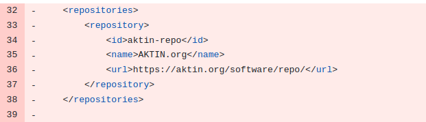   |
| Update: admin-gui           | 0.11   | 0.13rc1 |                                              |
| Update: report-manager      | 0.12   | 0.13    |                                              |
| Update: report-archive      | 0.12   | 0.13    |                                              |
| Update: report-schedule     | 0.12   | 0.13    |                                              |
| Update: request-manager     | 0.12   | 0.13    |                                              |
| Update: study-manager       | 0.12   | 0.13    |                                              |
| Update: aktin-monthly       | 0.12   | 0.13    |                                              |
|                             |        |         |                                              |
| Update: dwh-api             | 0.9    | 0.10    |                                              |
| Update: cda-import          | 0.17   | 0.19rc1 |                                              |
| Update:dwh-db               | 0.11   | 0.12    |                                              |
| Update: dwh-prefs           | 0.11   | 0.12    |                                              |
| Update: aktin               | 0.11   | 0.12    |                                              |
| developer connection        |        |         | Irrelevant                                   |

**Änderungen im debian-dwh-pkg von version 1.5 zu 1.6cr1-2**

<table>
<colgroup>
<col style="width: 7%" />
<col style="width: 40%" />
<col style="width: 40%" />
<col style="width: 11%" />
</colgroup>
<thead>
<tr class="header">
<th>Änderung</th>
<th>1.5</th>
<th>1.6cr-2</th>
<th>Mögliche Auswirkungen</th>
</tr>
</thead>
<tbody>
<tr class="odd">
<td>Installieren des DWHs als j2ee</td>
<td>
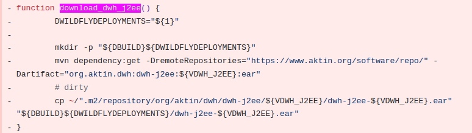

function download_dwh_j2ee() { 
    DWILDFLYDEPLOYMENTS="${1}"

    mkdir -p "${DBUILD}${DWILDFLYDEPLOYMENTS}" 
    mvn dependency:get -DremoteRepositories="<a
href="https://www.aktin.org/software/repo/">https://www.aktin.org/software/repo/</a>"
-Dartifact="org.aktin.dwh:dwh-j2ee:${VDWH_J2EE}:ear" 
    # dirty 
    cp
~/".m2/repository/org/aktin/dwh/dwh-j2ee/${VDWH_J2EE}/dwh-j2ee-${VDWH_J2EE}.ear"
"${DBUILD}${DWILDFLYDEPLOYMENTS}/dwh-j2ee-${VDWH_J2EE}.ear" 
}
</td>
<td>
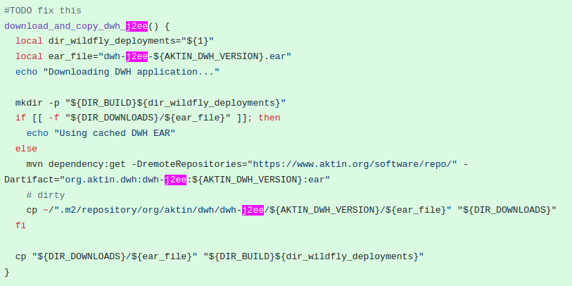

#TODO fix this 
download_and_copy_dwh_j2ee() { 
  local dir_wildfly_deployments="${1}" 
  local ear_file="dwh-j2ee-${AKTIN_DWH_VERSION}.ear" 
  echo "Downloading DWH application..."

  mkdir -p "${DIR_BUILD}${dir_wildfly_deployments}" 
  if [[ -f "${DIR_DOWNLOADS}/${ear_file}" ]]; then 
    echo "Using cached DWH EAR" 
  else 
    mvn dependency:get -DremoteRepositories="<a
href="https://www.aktin.org/software/repo/">https://www.aktin.org/software/repo/</a>"
-Dartifact="org.aktin.dwh:dwh-j2ee:${AKTIN_DWH_VERSION}:ear" 
    # dirty 
    cp
~/".m2/repository/org/aktin/dwh/dwh-j2ee/${AKTIN_DWH_VERSION}/${ear_file}"
"${DIR_DOWNLOADS}" 
  fi

  cp "${DIR_DOWNLOADS}/${ear_file}"
"${DIR_BUILD}${dir_wildfly_deployments}" 
}
</td>
<td><ul>
<li>
Da steht ein TODO!
</li>
</ul></td>
</tr>
<tr class="even">
<td></td>
<td></td>
<td></td>
<td></td>
</tr>
<tr class="odd">
<td></td>
<td></td>
<td></td>
<td></td>
</tr>
</tbody>
</table>

### Lösung

|     |
|-----|

1.  **Verwandte Artikel**

2.  

- Page:[DWH 1.6 Update depends on postgresql
  \<=229](#dwh-1.6-update-depends-on-postgresql-229)

- Page:[DWH Update 1.6 verbindet sich nicht mehr mit dem
  Broker](#dwh-update-1.6-verbindet-sich-nicht-mehr-mit-dem-broker)

- Page:[Zugriff per PGAdmin auf ein lokales AKTIN
  DWH](#zugriff-per-pgadmin-auf-ein-lokales-aktin-dwh)

- Page:[HTTPS-Zugriff aktivieren](#https-zugriff-aktivieren)

- Page:[DWH Logdateien erstellen](#dwh-logdateien-erstellen)

## DWH verliert regelmäßig Kontakt mit Broker bis zum Wildfly neustart

### Hintergrund

Nahc einiger Zeit verzeichnet eine Klinik keine Imports mehr am Broker,
es werden jedoch Fälle Importiert. Nach einem Neustart des Wildfly
Server ist das Problem für kurze Zeit wieder behoben.

### Vermutung

Es scheint nach dem aktuellen Wissensstand so zu sein, dass die Firewall
der Klinik die Connections des Wildfly Servers schließt, Wildfly diese
jedoch nicht schließt, durch irregulärem Einwirken der Firewall.
Vermutlich erzeugt Wildfly daraufhin weitere Connection die nach Nutzung
und kurzer Inaktivität auch von der Firewall blockiert werden und füllen
so langsam den Connection Pool bis dieser voll ist mit unbrauchbaren
Connections.

Hierzu lasse ich folgende Schritte zur Überprüfung durchlaufen:

<table>
<colgroup>
<col style="width: 9%" />
<col style="width: 19%" />
<col style="width: 50%" />
<col style="width: 20%" />
</colgroup>
<thead>
<tr class="header">
<th>Schritt</th>
<th>Beschreibung</th>
<th>Befehl</th>
<th>Bemerkung</th>
</tr>
</thead>
<tbody>
<tr class="odd">
<td>1</td>
<td>Öffne J Boss CLI</td>
<td><strong>sudo ./opt/wildfly/bin/jboss-cli.sh</strong></td>
<td></td>
</tr>
<tr class="even">
<td>2 </td>
<td>Prüfe, ob Datasource von AKTIN DWH logging aktiviert hat</td>
<td><strong>/subsystem=datasources/data-source=AktinDS:write-attribute(name=statistics-enabled,
value=true)</strong></td>
<td>suche nach Feld "statistics-enabled", standartmäßig auf
"false" </td>
</tr>
<tr class="odd">
<td>3</td>
<td>aktiviere Logging für AKTIN DWH Datasource</td>
<td>
<strong>/subsystem=datasources/data-source=AktinDS:write-attribute(name=statistics-enabled,
value=true)</strong>

<strong>:reload</strong>
</td>
<td>geht theoretisch auch, wenn man die konfig manuell in die
standalone.xml schreibt und wildfly neu startet</td>
</tr>
<tr class="even">
<td>4</td>
<td>prüfe Connection Pool status </td>
<td><strong>/subsystem=datasources/data-source=AktinDS/statistics=pool:read-resource(include-runtime=true)</strong></td>
<td>
"ActiveCount" - Connections in use

"AvailableCount" - idle/oder available Connections

"TimedOut" - wie viele Connection Requests "Timed out" sind
</td>
</tr>
<tr class="odd">
<td>5</td>
<td>Connection Pool vergrößern</td>
<td>
<strong>/subsystem=datasources/data-source=AktinDS:write-attribute(name=max-pool-size,
value=50)</strong>

<strong>:reload</strong>

<strong> </strong>
</td>
<td>Dient hier nur zur Info, das Problem sollte bei ungeschlossenen
Connections nicht durch Pool Vergrößerung gelöst werden</td>
</tr>
<tr class="even">
<td>6</td>
<td>Weitere Pool Konfigurationen</td>
<td>
<strong>/subsystem=datasources/data-source=AktinDS:write-attribute(name=min-pool-size,
value=5)</strong>

<strong>/subsystem=datasources/data-source=AktinDS:write-attribute(name=pool-prefill,
value=true)</strong>

<strong>:reload</strong>
</td>
<td></td>
</tr>
</tbody>
</table>

### Verwandte Artikel

- Page:[Monatsbericht/Report: Abnormal Termination
  Exception](#monatsberichtreport-abnormal-termination-exception)

- Page:[DWH verliert regelmäßig Kontakt mit Broker bis zum Wildfly
  neustart](#dwh-verliert-regelmäßig-kontakt-mit-broker-bis-zum-wildfly-neustart)

- Page:[Wildfly Startet nicht mehr](#wildfly-startet-nicht-mehr)

- Page:[Wildfly hat keine Verbindung zu
  Postgresql](#wildfly-hat-keine-verbindung-zu-postgresql)

- Page:[DWH 1.6 Update depends on postgresql
  \<=229](#dwh-1.6-update-depends-on-postgresql-229)

## Falsche IP auf automatisierten Mails des DWHs

### Hintergrund

Die lokalen DWH Instanzen senden den Betreibern automatisierte E-Mails,
beispielsweise wenn eine neue Anfrage aussteht. Hierbei leitet die
E-Mail den Betreiber mit einem Link direkt zur betroffenen Anfrage in
der Adminkonsole. Dieser Link benötigt die IP-Adresse der DWH Instanz,
welche sie sich aus dem Host zieht, wobei das letzte Netzprofil
(Interface) und deren IP als Host IP verwendet wird.

### Problem

Beim Update von DWH1.5 auf DWH1.6 wird ein neues Netzprofil (Interface)
angelegt, das meist "docker0" heißt. Dieses Interface mit einer eigenen
IP wird zukünftig als Host IP erkannt und in den automatisierten Mails
versendet, was jedoch kein gültiger Pfad ist.

### Lösung

Das Netwerk-Interface löschen.

<table>
<colgroup>
<col style="width: 100%" />
</colgroup>
<thead>
<tr class="header">
<th><blockquote>

1) Docker stoppen: "sudo systemctl stop docker"

2) Interface löschen: "sudo ip link delete docker0"

</blockquote></th>
</tr>
</thead>
<tbody>
</tbody>
</table>

### Verwandte Artikel

- Page:[Monatsbericht/Report: Abnormal Termination
  Exception](#monatsberichtreport-abnormal-termination-exception)

- Page:[DWH verliert regelmäßig Kontakt mit Broker bis zum Wildfly
  neustart](#dwh-verliert-regelmäßig-kontakt-mit-broker-bis-zum-wildfly-neustart)

- Page:[Wildfly Startet nicht mehr](#wildfly-startet-nicht-mehr)

- Page:[Wildfly hat keine Verbindung zu
  Postgresql](#wildfly-hat-keine-verbindung-zu-postgresql)

- Page:[DWH 1.6 Update depends on postgresql
  \<=229](#dwh-1.6-update-depends-on-postgresql-229)

## Firewall Probleme: Proxy

### Problem

Eine DWH ist nicht mit dem Broker verbunden, obwohl die Klinik die
Firewall vermeitlich richtig Konfiguriert hat.

### Lösung

Proxy im Wildfly Startscript eintragen

<table>
<colgroup>
<col style="width: 100%" />
</colgroup>
<thead>
<tr class="header">
<th><ul>
<li>
Broker Test Testseite auf DWH aufrufen.

<ul>
<li>
/aktin/admin/plain/test.html
</li>
</ul></li>
<li>
Können die Leute vom Rechener Broker aufrufen.

<ul>
<li>
<a
href="https://broker.aktin.org/broker/status">https://broker.aktin.org/broker/status</a>
</li>
<li>
<a
href="https://aktin-broker.klinikum.rwth-aachen.de/">https://aktin-broker.klinikum.rwth-aachen.de/</a>status
</li>
</ul></li>
<li>
Wenn 2. geht → Proxy Konfiguration Problem.

<ul>
<li>
Startscripten vom Wilfly eintragen

<ul>
<li>
Startoptionen JVM
</li>
</ul></li>
</ul></li>
</ul>
<ol type="1">
<li>
Broker Test Testseite auf DWH aufrufen.

<ul>
<li>
/aktin/admin/plain/test.html
</li>
<li>
Prüfen pb verbindung zum Broker da
</li>
</ul></li>
<li>
Können die Leute vom Rechner Broker aufrufen?

<ul>
<li>
<a
href="https://broker.aktin.org/broker/status">https://broker.aktin.org/broker/status</a>
</li>
<li>
<a
href="https://aktin-broker.klinikum.rwth-aachen.de/">https://aktin-broker.klinikum.rwth-aachen.de/</a>status
</li>
</ul></li>
<li>
Wenn 2. geht → Proxy Konfiguration Problem.

<ul>
<li>
Startscripten vom Wildfly eintragen

<ul>
<li>
Startoptionen JVM
</li>
</ul></li>
</ul></li>
</ol></th>
</tr>
</thead>
<tbody>
</tbody>
</table>

### Verwandte Artikel

- Page:[Monatsbericht/Report: Abnormal Termination
  Exception](#monatsberichtreport-abnormal-termination-exception)

- Page:[DWH verliert regelmäßig Kontakt mit Broker bis zum Wildfly
  neustart](#dwh-verliert-regelmäßig-kontakt-mit-broker-bis-zum-wildfly-neustart)

- Page:[Wildfly Startet nicht mehr](#wildfly-startet-nicht-mehr)

- Page:[Wildfly hat keine Verbindung zu
  Postgresql](#wildfly-hat-keine-verbindung-zu-postgresql)

- Page:[DWH 1.6 Update depends on postgresql
  \<=229](#dwh-1.6-update-depends-on-postgresql-229)

## Installation des DWH auf Ubuntu 24.04LTS

### Problem

Beim Installieren nach der Aktin Anleitung wird das Python Paket
unicodecsv benötigt, welches jedoch zu dem Zeitpunkt (10.10.2024) nicht
für Ubuntu 24 gibt. Die Installation geht von hieraus nicht weiter.

### Lösung

DWH Debian Paket manuell herunterladen, die Requirement entfernen und
das DWH Paket manuell installieren. Dies ist nur eine Voröbergehende
Lösung, an einem Upgrade wird bald gearbeitet.

<table>
<colgroup>
<col style="width: 100%" />
</colgroup>
<thead>
<tr class="header">
<th><blockquote>

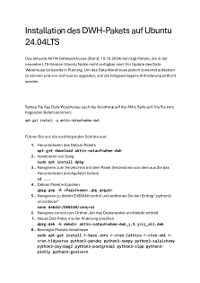

</blockquote></th>
</tr>
</thead>
<tbody>
</tbody>
</table>

### Weitere Lösung

1\. postgresql-12 ist nicht verfügbar auf Ubuntu24 (nur postgresql-16)  
2. Das Paket python3-unicodecsv ist nicht verfügbar auf Ubuntu24 (ist in
das python3 Paket gewandert)  
  
Um das DWH zu installieren, müssten Sie folgendes tun:  
  
  
1. BEVOR Sie das Paket aktin-notaufnahme-i2b2 installieren, das Paket
postgresql-16 installieren:

apt-get install postgresql-16

2\. Paket aktin-notaufnahme-i2b2 installieren:

apt-get install aktin-notaufnahme-i2b2  
  
  
3. Paket aktin-notaufnahme-dwh installieren über  
  
apt-get install aktin-notaufnahme-dwh --ignore-missing

### Verwandte Artikel

- Page:[Monatsbericht/Report: Abnormal Termination
  Exception](#monatsberichtreport-abnormal-termination-exception)

- Page:[DWH verliert regelmäßig Kontakt mit Broker bis zum Wildfly
  neustart](#dwh-verliert-regelmäßig-kontakt-mit-broker-bis-zum-wildfly-neustart)

- Page:[Wildfly Startet nicht mehr](#wildfly-startet-nicht-mehr)

- Page:[Wildfly hat keine Verbindung zu
  Postgresql](#wildfly-hat-keine-verbindung-zu-postgresql)

- Page:[DWH 1.6 Update depends on postgresql
  \<=229](#dwh-1.6-update-depends-on-postgresql-229)

## Login Probleme

### AKTIN Rolle richtig setzen:

**Problembeschreibung**: Login in das I2B2 möglich, nicht aber in das
Admin Webinterface des DWH.

[AKTIN Rollen](#aktin-rollen)

### AKTIN Rollen

Für einen Login im Data Warehouse Manger ist es notwendig, dass die
dafür notwendige Admin Berechtigung vergeben ist. In dem folgenden
Beispiel ist der user "demo" kein Admin (da false).

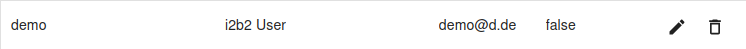

Ein Login ist daher nicht möglich:

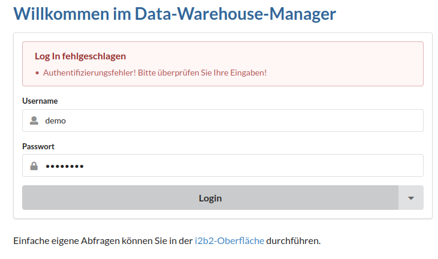

Wenn aber das Adminattribut auf "true" gesetzt wurde, ist ein Login
möglich (bei gleichem Passwort):

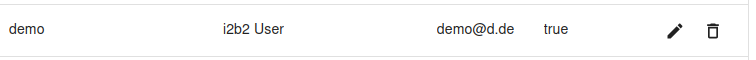

Dann ist ein Login möglich:

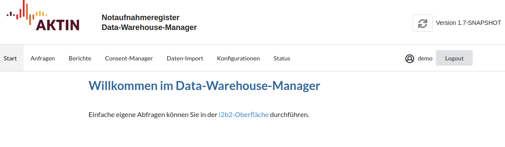

## Monatsbericht/Report: Abnormal Termination Exception

### Problem

Beim Generieren eines Monatsberichts wird der Prozess mit einem Fehler
Abgebrochen und der Log zeigt eine Abnormal Termination Exception in
Zusammenhang mit "RScript" an.

### Grund

Tidyverse installation nicht korrekt.

### Lösung

Auf dem Server alle R Pakete deinstallieren und daraufhin wieder
installieren. Wildfly daraufhin neu starten.

<table>
<colgroup>
<col style="width: 100%" />
</colgroup>
<thead>
<tr class="header">
<th><blockquote>

R-Terminal öffnen:

<strong>"R"</strong>

EIn Beispiel um nur das Tidyverse Paket versioniert zu
neuinstallieren, EIngabe in das Server Terminal.

"<strong>install.packages("tidyverse")</strong>"

prüfen ob Paket geladen werden kann:

"<strong>library("tidyverse")</strong>"

Falls nicht, das Paket entfernen und neu installieren:

"<strong>remove.packages("tidyverse")</strong>" und
"<strong>install.packages("tidyverse")</strong>"

Falls das auch nicht geht, sind möglicherweise r dev Pakete nicht
richtig geladen. Dafür gehe aus der R Konsole raus
("q<strong>()</strong>") und führe den Befehl aus:

"s<strong>udo apt-get install libfontconfig1-dev libharfbuzz-dev
libfribidi-dev libfreetype6-dev libpng-dev libtiff5-dev
libjpeg-dev</strong>"

gehe zurück in die R Konsole ("sudo R") und installiere Tidyverse
neu:

"<strong>install.packages("tidyverse")</strong>"

Falls nach installieren von Tidyverse noch Pakete mit non-zero exit
code geladen werden, müssen diese Pakete manuell installiert werden mit
install.packages. Diese Methode kann man auch anstatt des zweiten und
dritten Schritts durchführen, ist jedoch mühsam bei vielen Paketen und
die zwei vorherigen Schritte können die Load reduzieren.

Falls das auch nicht funktioniert, siehe nach, ob die Firewall das R
Repository blockt, oder prüfe und ggf. ändere das CRAN Repository

</blockquote></th>
</tr>
</thead>
<tbody>
</tbody>
</table>

### Verwandte Artikel

- Page:[Monatsbericht/Report: Abnormal Termination
  Exception](#monatsberichtreport-abnormal-termination-exception)

- Page:[DWH verliert regelmäßig Kontakt mit Broker bis zum Wildfly
  neustart](#dwh-verliert-regelmäßig-kontakt-mit-broker-bis-zum-wildfly-neustart)

- Page:[Wildfly Startet nicht mehr](#wildfly-startet-nicht-mehr)

- Page:[Wildfly hat keine Verbindung zu
  Postgresql](#wildfly-hat-keine-verbindung-zu-postgresql)

- Page:[DWH 1.6 Update depends on postgresql
  \<=229](#dwh-1.6-update-depends-on-postgresql-229)

## Monatsbericht nicht erstellt: Patient ohne ID

### Problem

Beim Generieren eines Monatsberichts wird der Prozess mit einem Fehler
Abgebrochen und der Log zeigt "java.lang.NullPointerException: Patient
w/o ID".

### Grund

Es wurden Einträge aus der Datenbank gelöscht, während das DWH noch
aktiv war. Das hat dafür gesorgt, dass eine Tabelle die die gelöschten
Daten noch enthält, auf den leeren Eintrag in der DB gezeigt hat.

### Lösung

Mit dem Löschen-Skript
"[delete_encounter_from_dwh.sh](https://github.com/aktin/aktin-scripts/blob/main/dwh-scripts/delete_encounter_from_dwh.sh)"
aus dem Aktin Repository: <https://github.com/aktin/aktin-scripts.git>
die Einträge löschen, die in demselben Zeitraum der zuvor gelöschten
Daten liegen. Daraufhin den gesamten gelöschten Zeitraum
Nachimportieren. 

|     |
|-----|

### Verwandte Artikel

- Page:[Monatsbericht/Report: Abnormal Termination
  Exception](#monatsberichtreport-abnormal-termination-exception)

- Page:[DWH verliert regelmäßig Kontakt mit Broker bis zum Wildfly
  neustart](#dwh-verliert-regelmäßig-kontakt-mit-broker-bis-zum-wildfly-neustart)

- Page:[Wildfly Startet nicht mehr](#wildfly-startet-nicht-mehr)

- Page:[Wildfly hat keine Verbindung zu
  Postgresql](#wildfly-hat-keine-verbindung-zu-postgresql)

- Page:[DWH 1.6 Update depends on postgresql
  \<=229](#dwh-1.6-update-depends-on-postgresql-229)

## User I2B2 Datenbank Informationen auslesen

### User-Datenbankinformationen auslesen

sudo -i  
sudo -u postgres psql -d i2b2 --pset pager=off -c "SELECT \* FROM
i2b2pm.pm_user_data;"

Zu sehen ist nun die Ausgabe der Relation, wobei die Passworthashes
gerne geschwärzt werden können.

Zum Speichern in einer Datei, die mit uns geteilt werden kann, führen
Sie bitte den folgenden Befehl aus:  
sudo -u postgres psql -d i2b2 --pset pager=off -c
"SELECT \* FROM i2b2pm.pm_user_data;" \> user_data.txt

### Weitere Informationen zur Fehleranalyse

Für eine genauere Analyse bitten wir Sie, uns die Benutzerberechtigungen
zur Verfügung zu stellen. Dafür benötigen Sie Kommandozeilenzugriff auf
den Linux-Server, auf dem das AKTIN-DWH läuft.  
Bitte führen Sie die folgenden Befehle **einzeln** aus:

sudo -i   
sudo -u postgres psql -d i2b2 --pset pager=off -c
"SELECT \* FROM i2b2pm.pm_user_data;" \> user_data.txt   
sudo -u postgres psql -d i2b2 --pset pager=off -c
"SELECT \* FROM i2b2pm.pm_user_params;" \> user_params.txt   
sudo -u postgres psql -d i2b2 --pset pager=off -c
"SELECT \* FROM i2b2pm.pm_user_session;" \> user_session.txt   
sudo -u postgres psql -d i2b2 --pset pager=off -c
"SELECT \* FROM i2b2pm.pm_user_login;" \> user_login.txt

**Hinweis:** Die Warnung  
could not change directory to "/root": Permission
denied  
kann ignoriert werden und ist unkritisch.

Sie können die Passwort-Hashes in
user_data.txt (Spalte
password) gerne entfernen oder die
entsprechende Spalte auf Screenshots schwärzen.  
Bitte senden Sie uns anschließend die vier generierten Dateien zu (sie
befinden sich im aktuellen Arbeitsverzeichnis).

## Wildfly hat keine Verbindung zu Postgresql

### Hintergrund

Wildfly startet nicht

### Fehlersuche

<table>
<colgroup>
<col style="width: 8%" />
<col style="width: 15%" />
<col style="width: 42%" />
<col style="width: 12%" />
<col style="width: 22%" />
</colgroup>
<thead>
<tr class="header">
<th>Schritt</th>
<th>Beschreibung</th>
<th>Befehl</th>
<th>Ausschnitt</th>
<th>Bemerkung</th>
</tr>
</thead>
<tbody>
<tr class="odd">
<td>1</td>
<td>Postgres Status checken</td>
<td><strong>sudo systemctl status postgresql</strong></td>
<td></td>
<td><ul>
<li>
muss active(running) anzeigen
</li>
</ul></td>
</tr>
<tr class="even">
<td></td>
<td>ggf. starten </td>
<td><strong>sudo systemctl start postgresql</strong></td>
<td></td>
<td></td>
</tr>
<tr class="odd">
<td>2</td>
<td>Prüfe den Port, auf dem Postgresql läuft</td>
<td><strong>cat /etc/postgresql/*/main/postgresql.conf | grep
port</strong></td>
<td></td>
<td></td>
</tr>
<tr class="even">
<td>3</td>
<td>Prüfe, ob Wildfly auf den richtigen Port hört. Siehe hierzu Wildfly
logs an</td>
<td><strong> </strong></td>
<td></td>
<td>Standardmäßig erwartet Wildfly Port 5432</td>
</tr>
</tbody>
</table>

### Verwandte Artikel

- Page:[Monatsbericht/Report: Abnormal Termination
  Exception](#monatsberichtreport-abnormal-termination-exception)

- Page:[DWH verliert regelmäßig Kontakt mit Broker bis zum Wildfly
  neustart](#dwh-verliert-regelmäßig-kontakt-mit-broker-bis-zum-wildfly-neustart)

- Page:[Wildfly Startet nicht mehr](#wildfly-startet-nicht-mehr)

- Page:[Wildfly hat keine Verbindung zu
  Postgresql](#wildfly-hat-keine-verbindung-zu-postgresql)

- Page:[DWH 1.6 Update depends on postgresql
  \<=229](#dwh-1.6-update-depends-on-postgresql-229)

## Wildfly Startet nicht mehr

### Hintergrund

Beim Aufrufen der Adminkonsole kann es sein, dass keien Ressourcen
gefunden werden können. Das traf in der Vergangenheit auf, wenn die
Ubuntu Version oder DWH Version verändert wurde.

### Fehlersuche

<table>
<colgroup>
<col style="width: 6%" />
<col style="width: 12%" />
<col style="width: 32%" />
<col style="width: 13%" />
<col style="width: 35%" />
</colgroup>
<thead>
<tr class="header">
<th>Schritt</th>
<th>Beschreibung</th>
<th>Befehl</th>
<th>Ausschnitt</th>
<th>Bemerkung</th>
</tr>
</thead>
<tbody>
<tr class="odd">
<td>1</td>
<td>Wildfly Status checken</td>
<td>
<strong>sudo service wildfly status</strong>

oder

<strong>sudo systemctl status wildfly.service</strong>
</td>
<td></td>
<td><ul>
<li>
muss active(running) anzeigen
</li>
</ul></td>
</tr>
<tr class="even">
<td>2</td>
<td>Wildfly Logs checken</td>
<td><strong>sudo nano
/opt/wildfly/standalone/log/server.log</strong></td>
<td></td>
<td><ul>
<li>
suche nach logs die "ERROR" anzeigen
</li>
</ul></td>
</tr>
<tr class="odd">
<td></td>
<td>Wenn keine Wildlfy logs verfügbar, Wldfly manuell mit Skript
starten</td>
<td><strong>sudo ./opt/wildfly/bin/standalone.sh</strong></td>
<td></td>
<td></td>
</tr>
<tr class="even">
<td>3</td>
<td>Deployments ansehen</td>
<td><strong>sudo ls /opt/wildfly/standalone/deployments/</strong></td>
<td></td>
<td><ul>
<li>
Prüfe ob die Dateien Endungen haben wie ".failed" oder
".isDeploying". Nur wenn wie hier alle Dateien auf ".deployed" enden,
ist alles gut
</li>
</ul></td>
</tr>
<tr class="odd">
<td>4</td>
<td>Apache Status checken</td>
<td><strong>sudo systemctl status apache2</strong></td>
<td></td>
<td><ul>
<li>
muss active(running) anzeigen
</li>
<li>
bei Fehler wird in der Konsole ausgegeben, wie der Log ausgegeben
werden kann, dort muss man nach dem Fehler suchen, meistens ein Modul
das nicht gefunden wird. Wenn das Modul existier, aber in einer anderen
Version (prüfe mit &lt;modulname&gt; -v) dann muss man die Apache
konfiguration Ändern:

<ul>
<li>
sudo a2dismod &lt;modulname&gt;&lt;alteversion&gt;
</li>
<li>
sudo a2enmod &lt;modulname&gt;&lt;neueversion&gt;
</li>
<li>
sudo systemctl restart apache2
</li>
</ul></li>
</ul></td>
</tr>
</tbody>
</table>

### Bekannte Probleme

- Wildfly hat keine Rechte für die Wildfly Ordner

  - Lösung:  
     "

    sudo chown -R wildfly:wildfly /opt/wildfly

    sudo chmod +x /opt/wildfly/bin/standalone.sh  
    "

- Wildfly hat keine Verbindung zu Postgresql

  - Lösung: [Wildfly hat keine Verbindung zu
    Postgresql](#wildfly-hat-keine-verbindung-zu-postgresql)

### Verwandte Artikel

- Page:[Monatsbericht/Report: Abnormal Termination
  Exception](#monatsberichtreport-abnormal-termination-exception)

- Page:[DWH verliert regelmäßig Kontakt mit Broker bis zum Wildfly
  neustart](#dwh-verliert-regelmäßig-kontakt-mit-broker-bis-zum-wildfly-neustart)

- Page:[Wildfly Startet nicht mehr](#wildfly-startet-nicht-mehr)

- Page:[Wildfly hat keine Verbindung zu
  Postgresql](#wildfly-hat-keine-verbindung-zu-postgresql)

- Page:[DWH 1.6 Update depends on postgresql
  \<=229](#dwh-1.6-update-depends-on-postgresql-229)
